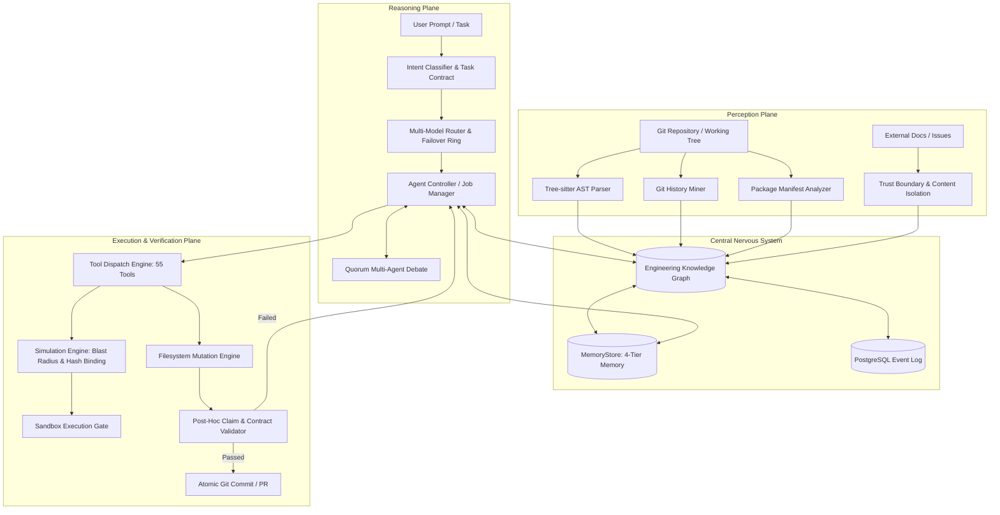
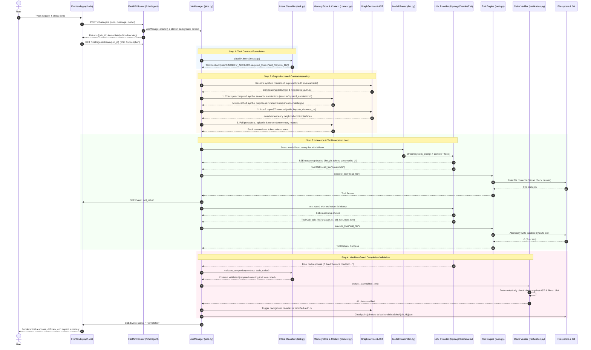
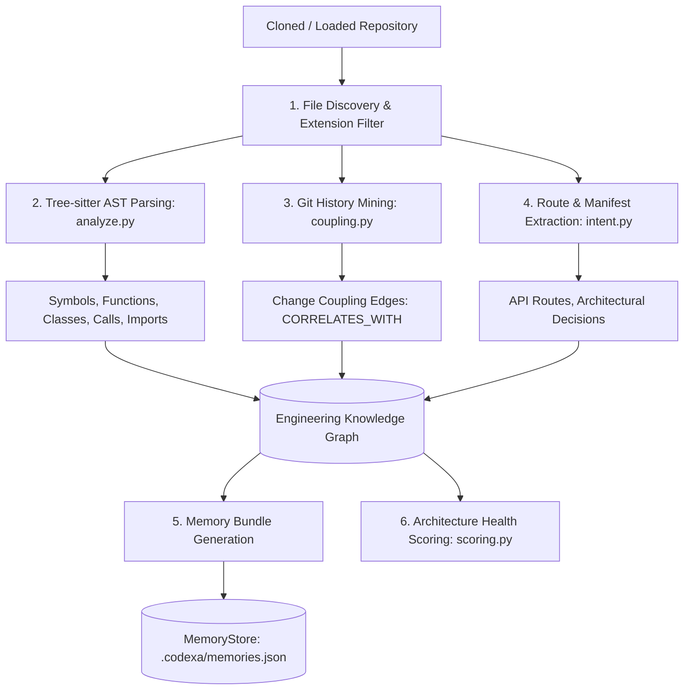
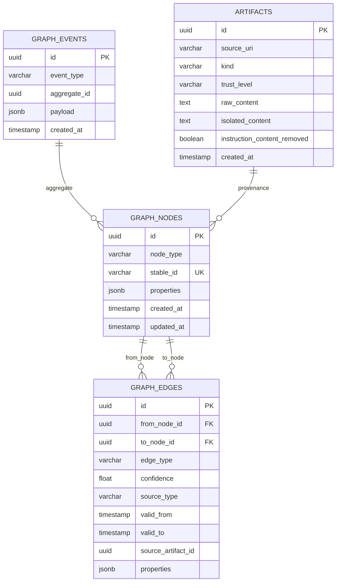
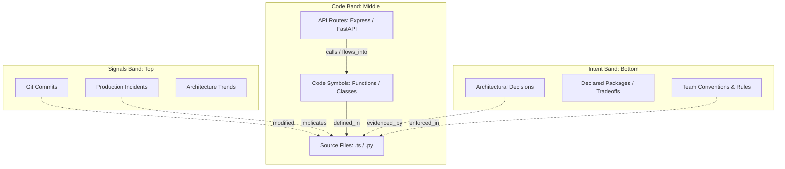
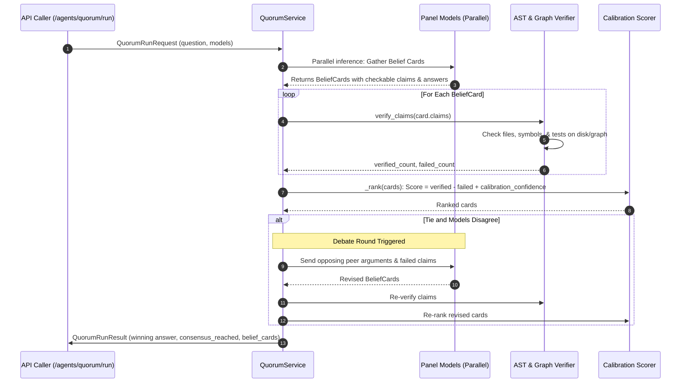
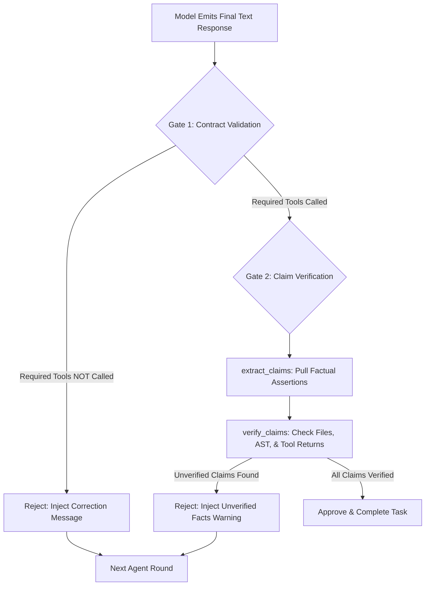
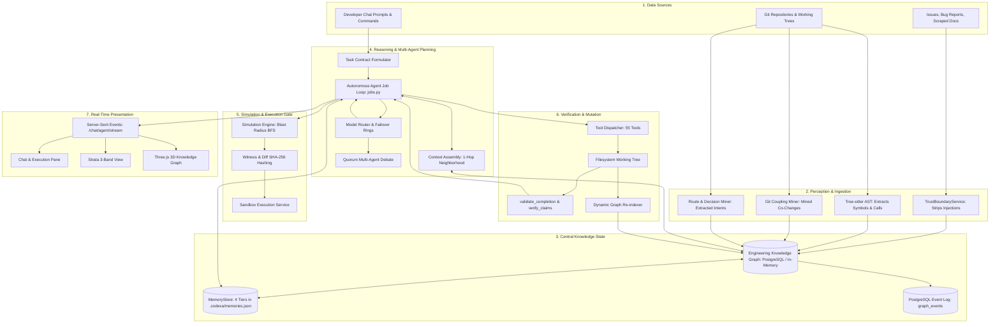
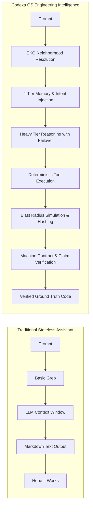

# Codexa — Complete Internal Architecture and Functionality Documentation

## 1. Executive Summary

Codexa OS is an **Engineering Intelligence Platform** designed to act as a persistent, self-healing, and mathematically verifiable "digital twin" of a software repository. Unlike conventional AI coding assistants that simply wrap a chat user interface around a stateless Large Language Model (LLM) context window, Codexa OS anchors all reasoning, planning, code authoring, and verification in an **Engineering Knowledge Graph (EKG)**. Every subsystem in the platform—including static AST parsers, git change-coupling miners, multi-agent debate protocols, simulation sandboxes, and continuous learning pipelines—reads from and writes directly to this central graph.

This document represents an exhaustive, ground-truth technical audit and architectural reverse-engineering of the Codexa OS codebase. Every claim, subsystem, API endpoint, tool, model router path, and background job described herein has been verified directly against the production Python and TypeScript source code.

### Core Architectural Findings at a Glance
1. **Source of Truth Architecture**: PostgreSQL with JSONB schema acts as the durable, transactional source of truth and event log. The system includes an in-memory graph repository (`InMemoryGraphRepository`) with turnkey in-memory event streaming for local zero-dependency development, and a PostgreSQL repository (`PostgresGraphRepository`) for production persistence. Read-optimized projections (Neo4j for topological cypher queries and Qdrant for dense vector similarity) are formally specified in the architecture; currently, the active backend operates directly on PostgreSQL and in-memory graph indices.
2. **Deterministic Dual-Loop Execution**: Codexa separates work into a high-frequency **Fast Loop** (the agent tool-calling execution engine running in `backend/agents/jobs.py` with multi-provider failover, live reasoning streams, and atomic checkpointing) and a low-frequency **Slow Loop** (background git mining, architectural drift projection, policy distillation, and multi-store event reconciliation).
3. **Machine-Verifiable Task Contracts**: Codexa enforces the principle: *"Never confuse generating an implementation with implementing it."* Every user message is classified into a strict `TaskContract` with explicit required tools. If an agent hallucinates a fix in chat prose without calling a mutating filesystem tool (`write_file`, `edit_file`, `delegate_task`), the completion validator mechanically rejects the response and forces a corrective execution round.
4. **Quorum Grounded Multi-Agent Debate**: To eliminate sycophancy and hallucinations during high-stakes architecture decisions, Codexa's Quorum subsystem gathers structured "belief cards" across diverse model providers, deterministically verifies their factual claims against the repository AST and Knowledge Graph, and triggers adversarial peer debate rounds only when top-ranking models disagree.
5. **Simulation & Sandbox Hash-Binding**: Code changes cannot touch production without passing the Engineering Simulation Engine, which calculates blast radius via reverse-BFS traversal and hashes the exact diff and witnessed subgraph using SHA-256. The sandbox execution gate cryptographically verifies that neither the code nor the dependency graph has drifted before scheduling Docker execution.

---

## 2. What Codexa Is

### Simple Explanation
Imagine you hire a brilliant principal software engineer who has complete photographic memory of every file, function, git commit, API route, and bug that has ever existed in your company's codebase. When you ask this engineer to build a feature, they do not merely start typing code into a text box. First, they pull up a dynamic, 3D architectural map of your system to see everything that depends on the code you want to change. Second, they verify whether a similar change caused a production outage three months ago. Third, if there is ambiguity, they convene a panel of senior architects to debate the tradeoffs. Fourth, they simulate the blast radius of their changes in a sandbox before applying them. Finally, after writing the code, they mechanically test that the files were created, functions compile, and claims hold true.

Codexa OS is the automated software platform that does exactly this.

### Technical Explanation
Codexa OS is an agentic, graph-native software engineering operating system. It treats a codebase not as unstructured text files or a flat sequence of prompt tokens, but as an attributed, typed, time-indexed directed property graph $G = (V, E, \tau)$.
- Vertices $V$ encompass structural code entities (files, classes, functions, API routes), organizational knowledge (architectural decisions, tradeoffs, team conventions), and operational events (incidents, pull requests, simulation scenarios).
- Edges $E$ define topological relationships (`calls`, `imports`, `depends_on`), causal chains (`causes`, `mitigates`, `increases_risk_of`), and traceability flows (`flows_into`, `traces_to_decision`).
- Temporal domain $\tau$ defines validity intervals $[\text{valid\\_from}, \text{valid\\_to}]$ for every relationship, enabling instantaneous point-in-time reconstruction of the codebase architecture via the Time Machine API.

Stateless LLMs fail on codebases exceeding 10,000 lines because context windows suffer from attention degradation ("needle in a haystack" loss), quadratic token cost scaling, and hallucinated import paths. Codexa OS overcomes these fundamental LLM limits by using static Tree-sitter parsers and git mining to construct a deterministic graph index, and then using graph-anchored context assembly to inject only the precise 1-to-2 hop semantic neighborhood of a targeted symbol into the LLM's prompt.

---

## 3. System Mental Model

The architecture of Codexa OS is organized around three fundamental planes: the **Perception Plane**, the **Reasoning Plane**, and the **Execution & Verification Plane**.



### The Dual-Loop Engine
1. **The Fast Loop (Seconds to Minutes)**:
   - Driven by `backend/agents/jobs.py` (`JobManager`).
   - Handles real-time user tasks via Server-Sent Events (SSE) streaming.
   - Evaluates task contracts, resolves model routing, executes tool calls, validates factual claims, and updates the local filesystem.
   - Emits granular lifecycle events (`round_start`, `reasoning_chunk`, `tool_call`, `tool_return`, `checkpoint`) to the frontend.
2. **The Slow Loop (Minutes to Hours)**:
   - Driven by background workers, repository rehydration threads, and nightly review routines.
   - Mines multi-commit git histories to detect latent change-coupling ($C_{ij} \ge 0.30$) between files that share no static import statements.
   - Re-evaluates architectural debt trajectories, extrapolating when coupled modules will reach unmaintainable complexity bottlenecks.
   - Distills incident post-mortems into permanent `PreventionRule` nodes that alter future blast-radius risk scoring.

---

## 4. Repository Structure

The Codexa OS codebase is structured into clean separation of concerns across backend services, frontend visualization, database migrations, and verification suites:

```
Codexa/
├── backend/                        # FastAPI Python application backend
│   ├── main.py                     # Application factory (create_app), ASGI middleware, router registration
│   ├── seed.py                     # Self-referential graph seeding for codexa-os repository
│   ├── agents/                     # Autonomous agent orchestration, execution loops, and tools
│   │   ├── api.py                  # Agent endpoints (/agents/planner, /agents/coder, /agents/quorum)
│   │   ├── coder.py                # CoderService for code generation proposals
│   │   ├── context_window.py       # Context window limits and token truncation rules
│   │   ├── controller.py           # Legacy controller interface
│   │   ├── design_intent.py        # Design intent extraction from user briefs
│   │   ├── impact.py               # Downstream blast radius and impact router (/agents/impact)
│   │   ├── jobs.py                 # Core JobManager, SSE streaming, failover rings, checkpointing (2,154 lines)
│   │   ├── llm.py                  # Multi-provider LLMClient, model registry, key rotation (786 lines)
│   │   ├── phased_build.py         # Multi-phase project scaffolding and build manager
│   │   ├── plan.py                 # ExecutionPlan and task state machine
│   │   ├── planner.py              # PlannerService for task breakdown and blast radius
│   │   ├── plan_builder.py         # Automatic plan assembly from intent
│   │   ├── progress.py             # Build progress tracking
│   │   ├── quorum.py               # QuorumService for structured multi-model debate (436 lines)
│   │   ├── receipts.py             # ActionReceipt tracking for tool execution proof
│   │   ├── research.py             # ResearchAgentService for repository Q&A
│   │   ├── retrieval.py            # ContextAssemblyService for graph traversal
│   │   ├── round_telemetry.py      # Telemetry per round
│   │   ├── semantic.py             # Semantic symbol analysis
│   │   ├── task.py                 # TaskIntent enum, TaskContract, and validate_completion (509 lines)
│   │   ├── token_budget.py         # Dynamic token allocation across planning and coding
│   │   ├── tools.py                # Comprehensive tool dispatch engine, 55 tools (3,555 lines)
│   │   ├── usage.py                # UsageTracker for prompt/completion/reasoning token accounting
│   │   ├── validators.py           # Syntax, lint, and build output validators
│   │   ├── verification.py         # Claim extraction and deterministic fact checking (256 lines)
│   │   └── design_skills/          # 10 specialized design knowledge guides (.md)
│   ├── chat/                       # Chat endpoints, streaming sessions, and agent job bridges
│   │   └── api.py                  # /chat/stream, /chat/agent, /chat/agent/job/{id}
│   ├── docs_gen/                   # Automated repository documentation generation
│   │   └── api.py                  # /docs-gen/generated, /docs-gen/regenerate
│   ├── execution/                  # Sandbox scheduling and command execution
│   │   ├── api.py                  # /execution/sandbox-runs
│   │   └── sandbox.py              # SandboxExecutionService with hash-binding verification
│   ├── files/                      # Filesystem CRUD operations and repository safety boundaries
│   │   └── api.py                  # /files/read, /files/write, /files/edit, /files/tree, /files/search
│   ├── graph/                      # Knowledge graph domain logic and repository abstractions
│   │   ├── api.py                  # /graph/nodes, /graph/edges, /graph/timeline, /graph/snapshots
│   │   ├── causal.py               # CausalGraphService for failure root cause chains
│   │   ├── consistency.py          # MultiStoreConsistencyService for outbox reconciliation
│   │   ├── data_flow.py            # DataFlowTracingService (schema -> route -> client)
│   │   ├── events.py               # GraphEventWriter (InMemory and Postgres implementations)
│   │   ├── repository.py           # GraphRepository (InMemory and Postgres implementations)
│   │   ├── schema.py               # Postgres table creation (ensure_schema)
│   │   ├── schemas.py              # GraphNode, GraphEdge, Node/Edge Type enums
│   │   └── service.py              # GraphService high-level query and mutation coordinator
│   ├── learning/                   # Continuous repository learning and policy distillation
│   │   ├── api.py                  # /learning/policy-distillation/runs
│   │   └── policy_distillation.py  # Distills repeated review rejections into policy rules
│   ├── memory/                     # Durable 4-tier memory system and conflict resolution
│   │   ├── api.py                  # /memory/records, /memory/types, /memory/context
│   │   ├── conflict.py             # Deterministic conflict resolution formula
│   │   ├── context.py              # Type-aware retrieval weighting and graph-anchored context
│   │   ├── records_api.py          # REST endpoints for CRUD on memory records
│   │   ├── schemas.py              # MemoryRecord schemas, IntentGraph, EngineeringDNA
│   │   ├── services.py             # IntentGraphService, EngineeringDNAService
│   │   └── store.py                # MemoryStore (.codexa/memories.json persistence)
│   ├── observability/              # Live agent inspection, metrics, and telemetry
│   │   └── api.py                  # /observability/events, /observability/usage, /observability/agents
│   ├── perception/                 # Ingestion pipeline, trust boundaries, and sanitization
│   │   ├── api.py                  # /perception/artifacts
│   │   ├── repository.py           # ArtifactRepository (InMemory and Postgres)
│   │   ├── schemas.py              # IngestArtifactRequest, TrustLevel enum
│   │   └── trust_boundary.py       # Prompt injection sanitization regexes
│   ├── repository/                 # Repository ingestion, Tree-sitter AST parsing, Git mining
│   │   ├── analyze.py              # Tree-sitter parsers (Python, JS, TS, TSX)
│   │   ├── api.py                  # /repository/load, /repository/create, /repository/list
│   │   ├── coupling.py             # Git log change-coupling miner
│   │   ├── intent.py               # Express/FastAPI route extractor, dependency analyzer
│   │   ├── scoring.py              # Repository architecture health scoring
│   │   └── semantic.py             # Semantic LLM-derived code symbol summaries
│   ├── simulation/                 # Pre-execution blast radius simulation
│   │   ├── api.py                  # /simulation/scenarios, /simulation/chaos/pre-mortems
│   │   ├── chaos.py                # ChaosPremortemService
│   │   ├── engine.py               # EngineeringSimulationEngine, SHA-256 diff hashing
│   │   └── witness.py              # Subgraph witness state hashing
│   ├── trust_safety/               # Health metrics, economics, calibration, and incident learning
│   │   ├── api.py                  # /trust-safety/health, /trust-safety/economics, /trust-safety/incidents
│   │   ├── confidence.py           # Multi-factor confidence calibration
│   │   ├── economics.py            # Technical debt score and engineering effort estimator
│   │   ├── explain.py              # Deterministic graph-templated incident explanation
│   │   ├── health.py               # RepositoryHealthService
│   │   ├── incident.py             # IncidentLearningService (causal graph builder)
│   │   ├── policy.py               # PolicyEngine execution gates
│   │   └── verification.py         # VerificationService
│   └── understanding/              # Architectural evolution and automated review
│       ├── api.py                  # /understanding/architecture/trends, /understanding/architecture/nightly-review
│       ├── architecture_evolution.py # Linear extrapolation of module coupling debt
│       └── nightly_review.py       # Automated codebase drift analysis
├── graph-viz/                      # Flagship Next.js 15 WebGL / Three.js Frontend Application
│   ├── app/                        # Next.js App Router
│   │   ├── (workspace)/            # Workspace layout shell with global navigation rail
│   │   │   ├── chat/page.tsx       # Live agent execution interface, chat history, impact cards
│   │   │   ├── strata/page.tsx     # 3-band architectural Strata visualization (Signals, Code, Intent)
│   │   │   ├── graph/page.tsx      # 3D interactive WebGL Knowledge Graph (Three.js)
│   │   │   ├── architecture/page.tsx # Architecture trends, health scores, and coupling matrices
│   │   │   ├── time-machine/page.tsx # Historical architecture replay and drift scrubber
│   │   │   ├── memory/page.tsx     # 4-tier memory inspector and conflict audit view
│   │   │   ├── ide/page.tsx        # In-browser repository code editor and tree browser
│   │   │   ├── docs/page.tsx       # Generated living documentation viewer
│   │   │   ├── usage/page.tsx      # Token usage, provider costs, and latency analytics
│   │   │   └── agents/page.tsx     # Active agent processes and Quorum inspection
│   ├── components/                 # React UI Components
│   │   ├── strata/                 # StrataView, Matrix, TimeBar, Glyph, Inspector
│   │   ├── graph/                  # GraphScene (Three.js canvas), GraphSearch, Inspector
│   │   ├── chat/                   # ExecutionPane, ImpactCard, RepoDialog
│   │   ├── shell/                  # Rail, RepoSwitcher, JobWatcher, PageHeader
│   │   └── ui/                     # ThinkingLoader, MarkdownView, Primitives
│   └── lib/                        # Client-side stores and math libraries
│       ├── api.ts                  # Fetch client for all 74 backend endpoints
│       ├── chat-store.ts           # Zustand/React state for chat conversations
│       ├── job-store.ts            # Active SSE job streaming and event dispatch
│       ├── repo-store.ts           # Selected active repository state
│       └── strata/                 # Custom geometry, cubic bezier routing, matrix layout
├── client/                         # Legacy React/Vite client application (minimal)
├── docs/                           # Authoritative architectural specifications
│   ├── codexa_os_build_prompt_v5.md # Ground-truth master specification v5
│   └── semantic_memory_layer_proposal.md # Memory architecture proposal
├── infra/                          # Infrastructure and container configurations
│   ├── docker-compose.yml          # PostgreSQL 16, Neo4j 5.x, Qdrant, Redis definitions
│   └── migrations/                 # PostgreSQL schema migrations
│       └── 0001_core.sql           # Core DDL for nodes, edges, events, and artifacts
├── tests/                          # Automated pytest test suites (79 files)
│   ├── audit/codexa_claims/        # 10 comprehensive claim verification suites
│   │   ├── runner.py               # Master test runner (10/10 passing suites)
│   │   └── evidence/               # Cryptographic JSON evidence files
│   └── benchmarks/                 # Memory and graph benchmarking suites
└── CODEXA_CLAIMS_AND_PROOF_AUDIT.md # Historical audit log with empirical evidence
```

---

## 5. High-Level Architecture

The architecture of Codexa OS is designed around strict unidirectional boundaries. Unsanitized external inputs cannot touch agent contexts, and unverified agent outputs cannot touch the filesystem.

```mermaid
flowchart TB
    subgraph Client Layer [Frontend Presentation Layer: graph-viz Next.js 15]
        UI_Chat[Chat & Execution Pane]
        UI_Strata[Strata 3-Band Architectural View]
        UI_Graph[Three.js 3D Knowledge Graph]
        UI_Time[Time Machine Temporal Scrubber]
        UI_Memory[Memory & Engineering DNA Inspector]
    end

    subgraph API_Gateway [FastAPI Gateway: backend/main.py]
        MW_Catch[_CatchUnhandledMiddleware]
        MW_CORS[CORSMiddleware]
        Router_Agents[/agents/* Router]
        Router_Chat[/chat/* Router]
        Router_Graph[/graph/* Router]
        Router_Memory[/memory/* Router]
        Router_Files[/files/* Router]
        Router_Sim[/simulation/* Router]
    end

    subgraph Core_Services [Domain Services Layer]
        JM[JobManager: jobs.py]
        LLM[LLMClient: llm.py]
        TB[TrustBoundaryService]
        PE[PolicyEngine & Verification]
        SIM[EngineeringSimulationEngine]
        AST[Tree-sitter Analyzer: analyze.py]
        MINE[Git Coupling Miner: coupling.py]
        INTENT[Route & Decision Miner: intent.py]
        MEM[MemoryStore: store.py]
        GS[GraphService: service.py]
        QRM[QuorumService: quorum.py]
    end

    subgraph Storage_Layer [Storage & Persistence Layer]
        PG[(PostgreSQL: 0001_core.sql)]
        MEM_JSON[(.codexa/memories.json)]
        JOBS_JSON[(backend/data/jobs/*.json)]
        REPOS_DIR[(.codexa/repos/*)]
        MEM_STORE[(In-Memory Graph State)]
    end

    UI_Chat -->|HTTP / SSE Stream| MW_Catch
    UI_Strata -->|REST Queries| MW_Catch
    UI_Graph -->|REST Nodes/Edges| MW_Catch
    MW_Catch --> MW_CORS
    MW_CORS --> Router_Chat & Router_Agents & Router_Graph & Router_Memory & Router_Files & Router_Sim

    Router_Chat --> JM
    Router_Agents --> QRM & SIM & PE
    JM --> LLM
    JM --> TB
    JM --> MEM
    JM --> GS
    JM -->|Mutations| Storage_Layer

    AST --> GS
    MINE --> GS
    INTENT --> GS
    GS --> PG & MEM_STORE
    MEM --> MEM_JSON
    JM --> JOBS_JSON
```

---

## 6. End-to-End Request Lifecycle

When a developer types a prompt into the Codexa OS interface—such as:
> *"Fix the race condition in auth token refresh and ensure user sessions do not drop."*

The following 18-step sequence is executed deterministically:



### 6.1 Step-by-Step Architectural Execution Sequence

1. **User Prompt Dispatch**: Developer enters a request in the Next.js frontend (`/graph-viz/app/(workspace)/chat/page.tsx`). The frontend sends an HTTP `POST /chat/agent` payload carrying the repository identifier, conversation history, user prompt, and model preference to FastAPI (`backend/api/chat.py`).
2. **Asynchronous Job Initialization**: FastAPI invokes `JobManager.create()`, allocating an isolated job thread, initializing message histories, and persisting a checkpoint JSON record to `backend/data/jobs/{job_id}.json`. The router immediately responds to the browser with `{ job_id }`.
3. **SSE Channel Subscription**: The browser establishes an EventSource connection to `GET /chat/agent/stream/{job_id}`, receiving real-time Server-Sent Events (`round_start`, `reasoning_chunk`, `tool_call`, `tool_return`, `status`).
4. **Task Contract Formulation (Step 1)**: `JobManager` dispatches the raw prompt to `IntentClassifier.classify_intent()` (`backend/agents/task.py`). The classifier matches regex signatures against intent categories (`MODIFY_ARTIFACT`, `ANALYZE`, `EXPLAIN`). For mutation requests, it generates a `TaskContract` enforcing that mutating tools (`edit_file`, `write_file`) must be executed before the job can complete.
5. **Symbol Candidate Matching**: Context assembly begins (`backend/memory/context.py`). The query string is tokenized and matched against targetable graph nodes (`CodeSymbol`, `File`, `Module`, `Package`) indexed in Neo4j/in-memory graph state.
6. **Pre-Computed Symbol Semantic Annotations Lookup (Checked First)**:
   - Before executing graph traversal or reading raw file contents, Codexa loads `symbol_annotations` records from `MemoryStore` (`backend/memory/context.py:_load_annotations` querying `memory_type="semantic"`, metadata `source="symbol_annotations"`).
   - These annotations were pre-computed asynchronously by `backend/repository/semantic.py` using light-tier LLM passes and keyed by `symbol://{repository}/{file}#{qualname}`.
   - For each matched symbol (e.g. `refreshToken`), Codexa extracts the cached one-line purpose summary, invariants, and structural behavior (`entry["summary"]`).
   - This prevents LLM context saturation: the model understands the semantic role of targeted functions immediately without requiring multi-thousand token raw source ingestion.
7. **1-to-2 Hop AST Neighborhood Traversal**: `GraphService` retrieves structural relationships (`calls`, `imports`, `depends_on`) anchored to the matched symbols. Up to 10 incoming/outgoing relations per match are extracted, grounding the agent in the immediate call graph.
8. **Procedural & Convention Memory Injection**: `MemoryStore` filters out raw cache blobs and scores procedural/episodic records against the prompt, appending architectural invariants, testing rules, and project-specific conventions to the system context.
9. **Model Routing & Inference**: `ModelRouter` (`backend/agents/llm.py`) selects the optimal provider from the heavy tier (Upstage Solar Pro, Gemini 2.5 Flash, GLM, etc.) with automatic failover on rate limits (HTTP 429). The system prompt, grounded context, memory digest, and tool schemas are dispatched.
10. **SSE Thought Token Streaming**: Reasoning chunks from the provider are streamed directly to the frontend's `ThinkingLoader` component in real time.
11. **Tool Invocation & Sandboxed Execution**: When the model emits a tool call (e.g., `read_file` or `edit_file`), `backend/agents/tools.py` validates arguments, enforces file path confinement to `.codexa/repos/`, checks secret boundaries, and executes the operation atomically.
12. **Machine-Gated Completion Validation**: When the model signals completion:
    - `task.py:validate_completion()` verifies that required tools from the `TaskContract` were actually executed.
    - `ClaimVerifier` (`backend/agents/verification.py`) parses the model's textual assertions against the AST and disk diffs, detecting hallucinated file edits or imaginary imports.
    - `GraphService` triggers background re-indexing of modified files.
    - `JobManager` marks job status as `completed`, writing the final state to disk and closing the SSE stream.

---

## 7. Frontend Architecture

The Codexa OS frontend is a modern web application built using **Next.js 15**, **React 19**, **Tailwind CSS**, and **Three.js** with WebGL rendering. It resides in the `/graph-viz` directory.

### 7.1 Core Pages and Routes
- `/chat` (`app/(workspace)/chat/page.tsx`): The primary agent interaction workspace. Displays real-time SSE streaming text, collapsible model thinking logs (`ThinkingLoader`), structured tool execution cards, impact assessments (`ImpactCard`), and repository dialogs (`RepoDialog`).
- `/strata` (`app/(workspace)/strata/page.tsx`): The flagship 3-band architectural visualizer. Renders Code, Signals, and Intent along horizontal planes with cubic bezier dependency routing and temporal scrubbing.
- `/graph` (`app/(workspace)/graph/page.tsx`): 3D interactive force-directed WebGL Knowledge Graph powered by Three.js (`components/graph/GraphScene.tsx`). Features live agent traversal illumination, node clustering, and symbol inspection.
- `/architecture` (`app/(workspace)/architecture/page.tsx`): Architectural trend charts, component coupling matrices, and technical debt projections.
- `/time-machine` (`app/(workspace)/time-machine/page.tsx`): Historical architectural drift scrubber allowing point-in-time graph state queries.
- `/memory` (`app/(workspace)/memory/page.tsx`): Visual explorer for the 4 memory tiers (Semantic, Episodic, Procedural, Organizational) and conflict resolution histories.
- `/ide` (`app/(workspace)/ide/page.tsx`): Full in-browser file tree browser and code viewer (`components/ide/CodeEditor.tsx`).
- `/docs` (`app/(workspace)/docs/page.tsx`): Living documentation viewer generated from the Knowledge Graph.
- `/usage` (`app/(workspace)/usage/page.tsx`): Real-time token consumption, reasoning budget accounting, and provider latency analytics.
- `/agents` (`app/(workspace)/agents/page.tsx`): Visual status board for background worker jobs and Quorum debate panels.

### 7.2 State Management and Networking
The frontend utilizes lightweight reactive stores:
- `job-store.ts`: Connects to backend SSE endpoints (`/chat/agent/stream/{job_id}`). Manages active jobs, decodes custom event streams, and maps raw events (`round_start`, `reasoning_chunk`, `tool_call`, `tool_return`, `checkpoint`) to React state.
- `chat-store.ts`: Manages conversation history, message trees, and model selection.
- `repo-store.ts`: Tracks the currently active repository, triggering re-fetching across all workspace views when switched.
- `api.ts`: Centralized fetch client wrapping all 74 backend REST endpoints with error normalization.

---

## 8. Backend Architecture

The backend is built with **FastAPI** and Python 3.12, located in `/backend`. The application entry point is `backend/main.py:create_app()`.

### 8.1 Middleware and Error Isolation Stack
To prevent silent failure modes in web browsers, `backend/main.py` introduces a specialized middleware sequence:
```python
app.add_middleware(_CatchUnhandledMiddleware)
app.add_middleware(
    CORSMiddleware,
    allow_origins=_DEV_ORIGINS,
    allow_credentials=False,
    allow_methods=["*"],
    allow_headers=["*"],
)
```
**The `_CatchUnhandledMiddleware` Invariant**:
Under Starlette, registering an `@app.exception_handler(Exception)` causes 500 errors to be caught by `ServerErrorMiddleware`, which sits *outside* `CORSMiddleware`. As a result, internal 500 exceptions are transmitted over the raw socket without CORS headers, causing the browser to report a misleading generic "Failed to fetch / Network Error". By implementing `_CatchUnhandledMiddleware` as an explicit `BaseHTTPMiddleware` registered *before* `CORSMiddleware`, unhandled exceptions are caught inside the CORS boundary, properly decorated with `Access-Control-Allow-Origin`, and returned as clean JSON error payloads.

### 8.2 Dependency Injection and Service Composition
`create_app()` initializes and wires 17 core domain services:
- `GraphService` (backed by `PostgresGraphRepository` or `InMemoryGraphRepository`)
- `CausalGraphService` and `DataFlowTracingService`
- `MultiStoreConsistencyService`
- `LLMClient` (handling multi-provider model routing)
- `PlannerService`, `CoderService`, `ResearchAgentService`, and `QuorumService`
- `ContextAssemblyService`
- `VerificationService`, `PolicyEngine`, `ConfidenceCalibrationService`, `EngineeringEconomicsService`, and `RepositoryHealthService`
- `EngineeringSimulationEngine` and `SandboxExecutionService`
- `ArchitectureEvolutionService` and `NightlyArchitectureReviewService`
- `MemoryStore`, `IntentGraphService`, and `EngineeringDNAService`
- `TrustBoundaryService`

---

## 9. API Reference

The backend exposes **74 distinct OpenAPI endpoints** covering the entire platform lifecycle. The table below documents every endpoint:

| Method | Path | Controller Function | Description | Implementation Status |
|---|---|---|---|---|
| `POST` | `/agents/planner/plan` | `create_plan` | Generates a structured execution plan from a goal | IMPLEMENTED |
| `POST` | `/agents/planner/blast-radius` | `calculate_blast_radius` | Computes downstream affected nodes from a change | IMPLEMENTED |
| `POST` | `/agents/coder/propose` | `propose_code_change` | Proposes a code diff from task specification | IMPLEMENTED |
| `POST` | `/agents/coder/proposals` | `create_coder_proposal` | Saves a coder proposal to the graph | IMPLEMENTED |
| `POST` | `/agents/research/ask` | `ask_research_question` | Answers architectural questions using the graph | IMPLEMENTED |
| `POST` | `/agents/research/recommendations` | `get_recommendations` | Recommends refactorings and dependency cleanups | IMPLEMENTED |
| `POST` | `/agents/retrieval/context` | `assemble_context` | Traverses graph for token-budgeted context assembly | IMPLEMENTED |
| `POST` | `/agents/quorum/run` | `run_quorum` | Executes multi-model debate with verified claims | IMPLEMENTED |
| `POST` | `/agents/impact` | `calculate_impact` | Evaluates file-level blast radius and incident history | IMPLEMENTED |
| `POST` | `/chat/stream` | `chat_stream` | Basic streaming chat endpoint | IMPLEMENTED |
| `POST` | `/chat/agent` | `start_agent_job` | Dispatches background autonomous agent job | IMPLEMENTED |
| `GET` | `/chat/agent/job/{job_id}` | `get_agent_job` | Polls current state and status of an agent job | IMPLEMENTED |
| `GET` | `/chat/agent/stream/{job_id}` | `stream_agent_job` | SSE stream emitting live tokens, tools, & events | IMPLEMENTED |
| `POST` | `/chat/agent/job/{job_id}/cancel` | `cancel_agent_job` | Cancels a running background agent job | IMPLEMENTED |
| `POST` | `/chat/agent/job/{job_id}/continue` | `continue_agent_job` | Resumes an interrupted or paused agent job | IMPLEMENTED |
| `POST` | `/chat/agent/phased` | `start_phased_build` | Initiates multi-phase project scaffolding build | IMPLEMENTED |
| `GET` | `/chat/agent/phased/{build_id}` | `get_phased_build` | Returns current phase and results of phased build | IMPLEMENTED |
| `POST` | `/chat/agent/phased/{build_id}/cancel` | `cancel_phased_build` | Terminates an active phased build | IMPLEMENTED |
| `GET` | `/chat/models` | `list_available_models` | Lists configured LLM models grouped by tier | IMPLEMENTED |
| `GET` | `/docs-gen/generated` | `get_generated_docs` | Retrieves living documentation for active repo | IMPLEMENTED |
| `POST` | `/docs-gen/regenerate` | `regenerate_docs` | Triggers background documentation regeneration | IMPLEMENTED |
| `POST` | `/execution/sandbox-runs` | `schedule_sandbox_run` | Validates hash-binding & schedules sandbox run | IMPLEMENTED |
| `GET` | `/files/tree` | `get_file_tree` | Returns recursive nested directory tree of repo | IMPLEMENTED |
| `GET` | `/files/read` | `read_file_content` | Reads file content (blocks secret filenames) | IMPLEMENTED |
| `POST` | `/files/write` | `write_file_content` | Writes complete file content atomically | IMPLEMENTED |
| `POST` | `/files/edit` | `edit_file_content` | Surgically replaces exact text matches | IMPLEMENTED |
| `POST` | `/files/save` | `save_file_content` | Saves file from UI IDE and triggers re-index | IMPLEMENTED |
| `POST` | `/files/delete` | `delete_file_path` | Deletes a file or empty directory | IMPLEMENTED |
| `POST` | `/files/move` | `move_file_path` | Moves or renames files/folders | IMPLEMENTED |
| `POST` | `/files/mkdir` | `make_directory` | Creates directories recursively | IMPLEMENTED |
| `GET` | `/files/search` | `search_file_contents` | Regex search across repository files | IMPLEMENTED |
| `POST` | `/graph/nodes` | `create_node` | Creates a typed node in the Knowledge Graph | IMPLEMENTED |
| `GET` | `/graph/nodes` | `list_nodes` | Lists graph nodes filtered by type or property | IMPLEMENTED |
| `POST` | `/graph/edges` | `create_edge` | Creates a directed, typed, confidence-scored edge | IMPLEMENTED |
| `GET` | `/graph/edges` | `list_edges` | Lists edges filtered by from/to or type | IMPLEMENTED |
| `GET` | `/graph/edges/all` | `list_all_edges` | Lists all active edges in the knowledge graph | IMPLEMENTED |
| `GET` | `/graph/timeline` | `get_graph_timeline` | Returns historical change events for time scrubber | IMPLEMENTED |
| `GET` | `/graph/snapshots` | `get_graph_snapshot` | Returns complete graph state at given timestamp | IMPLEMENTED |
| `POST` | `/graph/causal/chains` | `record_causal_chain` | Records incident -> root cause -> fix graph chain | IMPLEMENTED |
| `GET` | `/graph/causal/overview` | `get_causal_overview` | Returns aggregate statistics of causal incidents | IMPLEMENTED |
| `POST` | `/graph/consistency/checks` | `check_consistency` | Reconciles Postgres event log with projections | IMPLEMENTED |
| `POST` | `/graph/data-flow/traces` | `trace_data_flow` | Traces flow from database schema to API routes | IMPLEMENTED |
| `POST` | `/learning/policy-distillation/runs` | `run_policy_distillation` | Distills review rejections into prevention rules | IMPLEMENTED |
| `GET` | `/memory/records` | `list_memory_records` | Lists memory records for a repository | IMPLEMENTED |
| `POST` | `/memory/records` | `create_memory_record` | Creates memory record with conflict resolution | IMPLEMENTED |
| `GET` | `/memory/types` | `list_memory_types` | Returns supported memory types (4 tiers) | IMPLEMENTED |
| `GET` | `/memory/repositories` | `list_memory_repos` | Lists repositories having stored memory bundles | IMPLEMENTED |
| `GET` | `/memory/context` | `get_memory_context` | Retrieves type-weighted memory context for query | IMPLEMENTED |
| `POST` | `/memory/intent/chains` | `record_intent_chain` | Records decision, tradeoff, rejected alternative | IMPLEMENTED |
| `POST` | `/memory/organizational/conventions` | `record_convention` | Stores team convention profile | IMPLEMENTED |
| `POST` | `/memory/engineering-dna/conventions` | `record_dna` | Stores repo-specific Engineering DNA convention | IMPLEMENTED |
| `GET` | `/observability/events` | `list_observable_events` | Returns recent system-wide graph events | IMPLEMENTED |
| `GET` | `/observability/usage` | `get_usage_summary` | Returns total token usage and cost breakdown | IMPLEMENTED |
| `GET` | `/observability/usage/records` | `list_usage_records` | Returns itemized LLM request usage records | IMPLEMENTED |
| `GET` | `/observability/usage/daily` | `get_daily_usage` | Returns daily token usage aggregates | IMPLEMENTED |
| `GET` | `/observability/snapshots` | `get_system_snapshot` | Returns full health and memory system snapshot | IMPLEMENTED |
| `GET` | `/observability/agents` | `list_active_agents` | Returns status of all running background agents | IMPLEMENTED |
| `POST` | `/perception/artifacts` | `ingest_artifact` | Ingests external text through trust boundary | IMPLEMENTED |
| `POST` | `/repository/load` | `load_repository` | Clones/loads repo, runs AST & git coupling | IMPLEMENTED |
| `POST` | `/repository/create` | `create_repository` | Scaffolds a new local repository on disk | IMPLEMENTED |
| `GET` | `/repository/list` | `list_repositories` | Lists all loaded repositories on disk | IMPLEMENTED |
| `POST` | `/repository/activate` | `activate_repository` | Sets repository as active for chat and graph | IMPLEMENTED |
| `DELETE` | `/repository/{name}` | `delete_repository` | Deletes a loaded repository and its memory | IMPLEMENTED |
| `POST` | `/repository/annotate` | `annotate_repository` | Triggers LLM semantic annotation of symbols | IMPLEMENTED |
| `GET` | `/repository/docs` | `get_repository_docs` | Retrieves living architectural documentation | IMPLEMENTED |
| `POST` | `/repository/docs/regenerate` | `regenerate_repo_docs` | Forces full regeneration of repository docs | IMPLEMENTED |
| `POST` | `/simulation/scenarios` | `run_simulation` | Simulates blast radius and generates hash witness | IMPLEMENTED |
| `POST` | `/simulation/chaos/pre-mortems` | `run_chaos_premortem` | Injects synthetic faults to evaluate resilience | IMPLEMENTED |
| `POST` | `/trust-safety/confidence/calibrations` | `calibrate_confidence` | Computes weighted multi-factor confidence | IMPLEMENTED |
| `GET` | `/trust-safety/confidence/calibrations` | `list_calibrations` | Lists historical confidence calibration records | IMPLEMENTED |
| `POST` | `/trust-safety/economics/estimates` | `estimate_economics` | Computes technical debt score & effort hours | IMPLEMENTED |
| `POST` | `/trust-safety/health/repository` | `evaluate_repo_health` | Evaluates coupling, churn, and quality health | IMPLEMENTED |
| `POST` | `/trust-safety/incidents/learning` | `record_incident_learning` | Links incident to prevention rules in graph | IMPLEMENTED |
| `GET` | `/trust-safety/incidents/{id}/explain` | `explain_incident` | Graph-templated causal incident explanation | IMPLEMENTED |
| `POST` | `/trust-safety/policy/execution-gate` | `evaluate_execution_gate` | Checks if proposed change meets safety policy | IMPLEMENTED |
| `POST` | `/trust-safety/verification/proposals` | `verify_proposal` | Formally verifies proposal against assertions | IMPLEMENTED |
| `GET` | `/understanding/architecture/trends` | `get_architecture_trends` | Returns projected module coupling bottlenecks | IMPLEMENTED |
| `POST` | `/understanding/architecture/trends` | `record_architecture_trend` | Records architectural trend metric in graph | IMPLEMENTED |
| `POST` | `/understanding/architecture/nightly-review` | `run_nightly_review` | Runs automated review of architectural drift | IMPLEMENTED |

---


## 10. Model and Provider Architecture

Codexa OS implements a multi-provider LLM abstraction layer in `backend/agents/llm.py` (`LLMClient`). The layer wraps `litellm` while adding production reliability guarantees: per-model documented context windows, capability tiers, automatic rate-limit key rotation, and inter-provider failover rings.

### 10.1 Supported Providers
The system connects to **13 distinct model providers**:
1. **Google Gemini**: Vertex/Gemini API via `GEMINI_API_KEY` (supports multi-key rotation `_2`, `_3`, `_4`).
2. **Upstage**: Solar models via `UPSTAGE_API_KEY` (`https://api.upstage.ai/v1`).
3. **Upstage Debug**: Dedicated isolated test provider via `UPSTAGE_DEBUG_API_KEY` (isolated from production rotation pools).
4. **Z.ai (Zhipu AI)**: GLM models via `ZAI_API_KEY` (`https://api.z.ai/api/paas/v4`).
5. **NVIDIA NIM**: Microservices via `NVIDIA_API_KEY` (`https://integrate.api.nvidia.com/v1`).
6. **Groq**: LPU inference engine via `GROQ_API_KEY`.
7. **SiliconFlow**: Open-source models via `SILICONFLOW_API_KEY` (`https://api.siliconflow.com/v1`).
8. **TokenRouter**: Free-tier router via `TOKENROUTER_API_KEY` (`https://api.tokenrouter.com/v1`).
9. **Aerolink**: GPT-5.6 Sol via `AEROLINK_API_KEY` (`https://cgapi.aerolink.lat/v1`).
10. **Cerebras**: Ultra-fast wafer-scale inference via `CEREBRAS_API_KEY`.
11. **Mistral AI**: European frontier models via `MISTRAL_API_KEY`.
12. **AWS Bedrock**: Claude Haiku 4.5 via `AWS_BEARER_TOKEN_BEDROCK`.
13. **Ollama**: Local zero-egress daemon via `OLLAMA_API_BASE` (`http://localhost:11434`).

### 10.2 Capability Tiers and Registered Models
The `MODEL_REGISTRY` maps each model identifier to its human-readable label, real documented context window, capability tier, and provider:

```python
MODEL_REGISTRY: dict[str, tuple[str, int, str, str]] = {
    # Heavy & Ultra-Heavy Tier
    "aerolink/gpt-5.6-sol": ("GPT-5.6 Sol (Aerolink)", 200000, "ultra_heavy", "aerolink"),
    "tokenrouter/z-ai/glm-5.3-free": ("GLM 5.3 (free, TokenRouter)", 128000, "ultra_heavy", "tokenrouter"),
    "siliconflow/deepseek-ai/DeepSeek-V4.1-Flash": ("DeepSeek V4.1 Flash (SiliconFlow)", 128000, "heavy", "siliconflow"),
    "upstage/solar-pro4": ("Solar Pro 4 (Upstage)", 128000, "heavy", "upstage"),
    "gemini/gemini-3.8-flash": ("Gemini 3.8 Flash", 1048576, "heavy", "gemini"),
    "gemini/gemini-3.7-flash": ("Gemini 3.7 Flash", 1048576, "balanced", "gemini"),
    "groq/openai/gpt-oss-120b": ("GPT-OSS 120B (Groq)", 131072, "heavy", "groq"),
    "nvidia_nim/deepseek-ai/deepseek-v4-pro-0813": ("DeepSeek V4 Pro", 128000, "heavy", "nvidia"),
    "nvidia_nim/nvidia/nemotron-3-super-120b-a12b": ("Nemotron 3 Super 120B", 1000000, "heavy", "nvidia"),
    "zai/glm-4.7-flash": ("GLM 4.7 Flash (Z.ai)", 128000, "heavy", "zai"),
    
    # Balanced Tier
    "groq/qwen/qwen3.6-27b": ("Qwen3.6 27B (Groq)", 131072, "balanced", "groq"),
    "cerebras/qwen-3.8-27b": ("Qwen 3.8 27B (Cerebras)", 128000, "balanced", "cerebras"),
    "mistral/mistral-medium-latest": ("Mistral Medium Latest", 128000, "balanced", "mistral"),
    "inception/mercury-2.5": ("Mercury 2.5 (Inception)", 128000, "balanced", "inception"),
    
    # Light Tier (Delegated Workers, Fact Checkers, Subagents)
    "gemini/gemini-3.6-flash": ("Gemini 3.6 Flash", 1048576, "light", "gemini"),
    "gemini/gemini-2.5-flash": ("Gemini 2.5 Flash", 1048576, "light", "gemini"),
    "groq/openai/gpt-oss-20b": ("GPT-OSS 20B (Groq)", 131072, "light", "groq"),
    "groq/groq/compound-mini": ("Compound Mini (Groq)", 131072, "light", "groq"),
    "openrouter/nvidia/nemotron-3.5-lightning:free": ("Nemotron 3.5 Lightning (free)", 1000000, "light", "openrouter"),
    "bedrock/global.anthropic.claude-haiku-4-5-20251001-v1:0": ("Claude Haiku 4.5 (Bedrock)", 200000, "light", "bedrock"),
    "ollama_chat/josiefied-qwen3:latest": ("Qwen3 8B (Ollama, local)", 40960, "light", "ollama"),
    
    # Debug / Isolated Tier
    "upstage_debug/solar-pro4": ("Solar Pro 4 (Debug/Testing)", 128000, "debug", "upstage_debug"),
}
```

### 10.3 Failover Rings and Key Rotation
To guarantee resilience during long-running tasks, `LLMClient` implements two orthogonal failover mechanisms:
1. **Intra-Provider Key Rotation**: For providers like Gemini or TokenRouter where users configure multiple API keys (`GEMINI_API_KEY`, `GEMINI_API_KEY_2`, `GEMINI_API_KEY_3`), `_active_key_index` tracks the current key. When an HTTP 429 (Rate Limit) or 503 (Overloaded) is encountered, `LLMClient` advances the index and retries with the next key immediately without switching models.
2. **Inter-Provider Failover Rings (`_FAILOVER_RING`)**:
   - `ultra_heavy`: `aerolink/gpt-5.6-sol` -> `upstage/solar-pro4` -> `gemini/gemini-3.8-flash`
   - `heavy`: `upstage/solar-pro4` -> `gemini/gemini-3.8-flash` -> `groq/openai/gpt-oss-120b` -> `gemini/gemini-3.7-flash`
   If all keys for a primary provider are exhausted, the job loop rotates to the next model in the failover ring mid-turn, preserving the entire conversation history and tool state.
3. **Dedicated Worker Ring (`_WORKER_RING`)**:
   Subordinate tasks (such as mechanical code file generation via `delegate_task` or claim extraction in `verification.py`) are routed to `_WORKER_RING`:
   `gemini/gemini-3.8-flash` -> `gemini/gemini-3.7-flash` -> `gemini/gemini-3.6-flash` -> `gemini/gemini-2.5-flash`.
   This keeps expensive orchestrator reasoning quotas completely separate from worker quotas.

---

## 11. Prompt Architecture

Prompt generation in Codexa OS is strictly structured. Prompts are assembled by concatenating typed blocks rather than using free-form strings.

### 11.1 Dynamic Context Assembly Pipeline
For every turn in `backend/agents/jobs.py`, the model input is assembled as:

$$\text{Model Input} = \text{System Prompt} + \text{Task Contract} + \text{Memory Block} + \text{Graph Context} + \text{Design Brief} + \text{Conversation History} + \text{Tool Definitions}$$

1. **System Prompt**: Enforces operating rules, forbids placeholder code, mandates function-calling for file modifications, and forbids markdown summaries when tool calls are required.
2. **Task Contract**: Injected as an authoritative constraint:
   ```
   [TASK CONTRACT]
   Intent: MODIFY_ARTIFACT
   Required Tools: ['edit_file', 'write_file']
   Success Criteria: Ensure the auth refresh token expiration is verified.
   Constraints: Do not modify user session database schema.
   ```
3. **Memory Block (`MemoryStore.context_block`)**: Formats durable records across semantic, procedural, episodic, and organizational tiers.
4. **Graph Context (`ContextAssemblyService`)**: Resolves symbols mentioned in the prompt and extracts their 1-to-2 hop call/import dependencies.
5. **Design Brief (`backend/agents/design_intent.py`)**: When building user interfaces, extracts design principles (e.g. `anti_slop`, `apple_design`, `emil_design_eng`) and injects color palettes, spacing rules, and animation curves.

### 11.2 Specialized Subsystem Prompts
- **Claim Extraction Prompt (`backend/agents/verification.py`)**: Instructs the model to output a strict JSON list of positive, checkable factual claims (`file_exists`, `symbol_exists`, `test_passed`, `action_performed`).
- **Quorum Belief Card Prompt (`backend/agents/quorum.py`)**: Directs independent models to form a structured answer with explicit factual claims and self-assessed confidence scores.
- **Semantic Annotation Prompt (`backend/repository/semantic.py`)**: Analyzes raw function code and generates a one-sentence summary of what the symbol does, its side effects, and invariants.

---

## 12. Reasoning / Thinking Pipeline

Modern frontier models (including DeepSeek-R1, GLM-5.3, Mercury 2.5, and Gemini 2.0/3.0) produce explicit reasoning traces before emitting final text or tool calls.

### 12.1 Streaming and Token Extraction
In `backend/agents/jobs.py` (`_stream_response`), Codexa hooks into raw provider streams and separates reasoning tokens from content tokens:
- **Thinking / Reasoning Tokens**: Emitted as `delta.reasoning_content` (Z.ai, SiliconFlow, DeepSeek) or `delta.thought` (Gemini). Codexa streams these immediately as SSE events with `type: "reasoning_chunk"`. On the frontend, `ThinkingLoader` renders these inside an expandable accordion.
- **Content Tokens**: Emitted as `delta.content`. Streamed as `type: "content_chunk"` and accumulated for final output.
- **Tool Call Chunks**: Emitted as `delta.tool_calls`. Accumulated until the argument JSON block is complete, then dispatched to `tools.execute_tool()`.

### 12.2 Authoring Pathology and Safeguards
During long-running agent builds, autonomous models frequently exhibit an "authoring pathology":
1. **The Pathology**: A model reasons extensively (consuming 10,000–30,000 reasoning tokens) planning how to write a file, approaches its output token ceiling, and runs out of tokens right as it begins writing the actual file content, producing a truncated tool call.
2. **Safeguard 1: Token Budgeting & `_compact_stale_payloads`**: In long multi-round jobs, historical tool arguments (such as a 500-line file written 3 rounds ago) are replaced with `[compacted — 14,200 chars]`. This prevents the input context from exceeding the model's window.
3. **Safeguard 2: Consecutive Cut Detection (`consecutive_cuts`)**: If a model's stream is cut off mid-tool call twice in a row due to output token limits, Codexa intercepts the loop, injects an explicit system directive ("Your previous response was cut short. Use `delegate_task` to offload large file writes to a worker model"), and forces recovery.
4. **Safeguard 3: The Delegation Pattern (`delegate_task` / `delegate_build`)**: To prevent heavy reasoning orchestrators from generating large files twice (once in reasoning, once in tool arguments), orchestrators are instructed to formulate the plan and pass the raw writing to fast worker models.

---

## 13. Tool Architecture

Codexa OS provides **55 distinct tools** exposed via standard OpenAI/JSON function-calling schemas in `backend/agents/tools.py`.

### 13.1 The 8 Tool Groups
To prevent context saturation, Codexa does not expose all 55 tools on every turn. Instead, `classify_intent()` dynamically maps the user request to one or more of **8 tool groups**:

1. **`repo` (Repository Intelligence)**:
   - `read_file`: Reads file content safely.
   - `read_files`: Reads multiple files in a single turn.
   - `list_directory`: Lists directory children.
   - `tree`: Returns nested visual tree of project structure.
   - `search_code`: Fast regex/text search across files.
   - `lookup_symbol`: Queries Knowledge Graph for symbol definition, callers, and callees.
   - `list_symbols`: Lists all functions, classes, and components in a file.
   - `get_dependencies`: Returns incoming and outgoing imports for a symbol/file.
   - `get_project_metadata`: Detects framework, runtime, language, and package managers.
   - `find_references`: Finds all references to a symbol across the graph.
   - `get_file_outline`: Extracts structural outline of a file.
   - `detect_conventions`: Infers indentation, quoting, and architectural naming patterns.
   - `commit_direction`: Records architectural commitments to the memory store.
2. **`code` (Filesystem Mutations)**:
   - `write_file`: Creates or replaces a file with complete content.
   - `edit_file`: Surgically replaces exact old text with new text.
   - `delete_file`: Removes a file or empty directory.
   - `move_file`: Renames or relocates files and directories.
   - `create_directory`: Recursively creates directories.
   - `create_project`: Scaffolds a new project directory structure.
   - `apply_patch`: Applies multi-file atomic patches.
   - `create_files`: Atomically creates multiple files in one call.
3. **`runtime` (Execution & Verification)**:
   - `run_command`: Executes bash/powershell commands with 30s timeout.
   - `run_python`: Executes isolated Python scripts with 10s timeout.
   - `run_tests`: Runs the project test runner (`pytest`, `npm test`) and parses output.
   - `typecheck`: Runs `tsc` or `mypy` and returns structured error locations.
   - `lint`: Runs linter (`eslint`, `ruff`) returning structured warnings.
   - `build`: Runs production build pipeline (`vite build`, `next build`).
   - `get_build_errors`: Retrieves structured error diagnostics from the last build.
   - `start_dev_server`: Boots local dev server and returns the local URL.
4. **`browser` (Web & UI Automation)**:
   - `screenshot`: Captures viewport rendering of a local URL.
   - `browser_navigate`: Navigates headless browser to a route.
   - `browser_click`: Clicks elements by CSS selector.
   - `browser_type`: Enters text into form inputs.
   - `browser_console`: Inspects browser console errors and logs.
   - `browser_network`: Evaluates HTTP network requests and failed assets.
   - `browser_scroll`: Scrolls viewport by $(x, y)$ pixels.
   - `inspect_element`: Extracts computed CSS styles, layout dimensions, and a11y attributes.
   - `inspect_page`: Full page audit (DOM structure, console errors, performance).
5. **`design` (Design Intelligence)**:
   - `get_design_guidance`: Loads specialized design guides (`anti_slop`, `apple_design`, `emil_design_eng`).
   - `get_design_system`: Extracts colors, typography, spacing, and shadows from Tailwind/CSS.
   - `analyze_visual_hierarchy`: Evaluates layout contrast and typography hierarchy.
   - `check_design_consistency`: Identifies inconsistent spacing or colors across files.
   - `inspect_component`: Inspects props, styles, and usage counts of UI components.
6. **`git` (Version Control)**:
   - `git_status`: Shows modified, untracked, and deleted files.
   - `git_diff`: Displays exact staged/unstaged code diffs.
   - `git_log`: Inspects recent commit history.
   - `git_branch`: Lists branches and active branch.
   - `create_branch`: Creates and checks out a new branch.
   - `commit`: Stages changes and commits with conventional commit message.
   - `summarize_changes`: Summarizes lines added/removed, risk score, and test status.
7. **`external` (External Intelligence)**:
   - `web_search`: Queries public web via Tavily API for current documentation.
   - `semantic_search`: Queries embeddings for natural language code discovery.
8. **`orchestration` (Worker Delegation)**:
   - `delegate_task`: Offloads mechanical writing of pre-planned files to a fast worker model.
   - `delegate_build`: Passes high-level spec to a worker that writes code and saves files.
   - `generate_with_qwen`: Employs Qwen Plus Character on a dedicated quota for text/code drafting.

### 13.2 Security Filters and Execution Guards
`backend/agents/tools.py` enforces three deterministic security gates before dispatching any tool:
1. **Platform Mutation Guard (`_MUTATING_TOOLS`)**:
   Codexa OS strictly refuses to mutate its own source repository through agent tools. The guard intercepts all 18 mutating tools (`write_file`, `edit_file`, `delete_file`, `run_command`, `run_python`, etc.). If `repository == "codexa-os"` (or resolves to the platform worktree), execution raises:
   ```
   PermissionError: Refused to mutate platform repository: Codexa OS source code cannot be modified via agent tools.
   ```
2. **Secret File Exclusion (`_SECRET_FILENAMES`)**:
   Tools that read files (`read_file`, `read_files`) intercept access to credential stores (`.env`, `.env.local`, `credentials.json`, `id_rsa`, `*.pem`, `*.key`). The request is refused before opening the file, preventing secrets from leaking into LLM transcripts or persisted job checkpoints.
3. **Compacted Payload Defense (`_COMPACTED_MARK`)**:
   If an agent attempts to call `write_file` with content beginning with `"[compacted"`, the write is rejected. This prevents the agent from overwriting real source files with conversation truncation markers.

---

## 14. File Editing System

File mutations in Codexa OS are atomic and verifiable. The platform provides two primary editing interfaces: `write_file` (full file replacement) and `edit_file` (surgical chunk replacement).

### 14.1 Surgical Chunk Editing (`edit_file`)
`edit_file` requires three parameters: `path`, `old_text`, and `new_text`.
- **Exact Match Requirement**: The target file is read from disk. The system verifies that `old_text` exists in the file *exactly once*.
- **Ambiguity Guard**: If `old_text` appears multiple times, the tool raises an error requiring the agent to provide more surrounding context lines to make the match unique.
- **Diff Feedback**: Upon replacement, the tool returns the line numbers affected and a unified diff snippet, allowing the model to confirm the change in its next turn.

### 14.2 Atomic Write & Windows OneDrive Lock Mitigation
On Windows environments where the repository lives inside a synchronized directory (e.g. OneDrive), background file indexing locks files intermittently. An ordinary `os.replace` fails with `[WinError 5] Access is denied`.

`backend/files/api.py` and `backend/agents/jobs.py` implement an exponential backoff retry loop around all atomic file replacements:
```python
for attempt in range(5):
    try:
        temp_file.replace(target_file)
        break
    except PermissionError:
        time.sleep(0.05 * (2 ** attempt))
else:
    # Fallback to direct write if atomic rename is permanently locked
    target_file.write_text(content, encoding="utf-8")
```

---

## 15. Repository Intelligence

When a repository is imported via `POST /repository/load`, Codexa boots an end-to-end intelligence ingestion pipeline.



### 15.1 In-Memory Graph Seeding (`backend/seed.py`)
To enable instantaneous out-of-the-box local development without requiring external database services, setting `CODEXA_SEED=1` executes `seed_graph()`. This routine populates the in-memory graph with a self-referential model of Codexa OS itself:
- Creates repository root node `repo://codexa-os`.
- Models core backend and frontend modules as `File` nodes.
- Establishes `calls`, `imports`, and `depends_on` relationships between services.
- Seeds historical `CausalEvent` and `PreventionRule` nodes representing real system invariants.

### 15.2 Dynamic Re-Indexing
Whenever an agent executes a tool in `GRAPH_DIRTYING_TOOLS` (`write_file`, `edit_file`, `delete_file`, `apply_patch`), or a developer saves a file in the frontend IDE (`POST /files/save`), Codexa triggers `reindex_repository()`. The modified files are immediately re-parsed with Tree-sitter, updating the Knowledge Graph before the next agent turn or user query.

---

## 16. Tree-sitter / Static Analysis

Static analysis in Codexa OS is powered by official Tree-sitter native grammars in `backend/repository/analyze.py`.

### 16.1 Supported Grammars
- **Python**: `tree_sitter_python` (`_PY_LANG`)
- **JavaScript**: `tree_sitter_javascript` (`_JS_LANG`)
- **TypeScript**: `tree_sitter_typescript.language_typescript()` (`_TS_LANG`)
- **TSX / JSX**: `tree_sitter_typescript.language_tsx()` (`_TSX_LANG`)

### 16.2 AST Query Extraction
Codexa uses compiled Tree-sitter S-expression queries to extract symbol definitions and call sites with syntax-aware precision:
```scheme
;; Python Definition and Call Query
(function_definition name: (identifier) @def.name) @def.node
(class_definition name: (identifier) @def.name) @def.node
(call function: (identifier) @call.name)
(call function: (attribute attribute: (identifier) @call.name))
```
- **Scope Attribution**: Calls are attributed strictly to the enclosing function or method node by walking parent pointers in the Tree-sitter AST, eliminating regex false positives.
- **Syntax Error Resilience**: Tree-sitter produces a concrete syntax tree even when encountering malformed or incomplete code files. Unparseable tokens become `ERROR` nodes while surrounding valid functions are extracted cleanly.
- **Analysis Caps**: To ensure sub-second indexing on large repositories, extraction is bounded:
  - `_MAX_FILES = 1,500` source files
  - `_MAX_ALL_FILES = 6,000` total project files
  - `_MAX_SYMBOLS = 4,000` symbols
  - `_MAX_EDGES = 8,000` call/import edges
  - `_MAX_FILE_BYTES = 1,000,000` bytes (1 MB file size limit)

---

## 17. Symbol Intelligence

Extracted symbols are converted into first-class `CodeSymbol` nodes in the Knowledge Graph.

### 17.1 Symbol Schema and Identifiers
Every symbol receives a globally deterministic stable ID:
`symbol://{repository}/{posix_file_path}#{symbol_name}:{line_number}`

Properties attached to each symbol node include:
- `name`: Identifier name (e.g. `validate_completion`).
- `kind`: `function`, `class`, `method`, `component`, or `hook`.
- `file`: Path relative to repository root.
- `line`: Starting line number (1-indexed).
- `end_line`: Terminating line number from AST node span.
- `content_hash`: SHA-256 hash of the symbol's raw text for cache invalidation.

### 17.2 LLM Semantic Summarization (`backend/repository/semantic.py`)
In addition to static AST data, symbols undergo asynchronous semantic annotation:
1. `annotate_symbol()` extracts the raw implementation bytes of the symbol.
2. Dispatches a concise completion request to a light-tier model.
3. Produces a two-part annotation:
   - `summary`: One sentence explaining what the symbol accomplishes.
   - `behavior`: Invariants, expected exceptions, and external side effects.
4. The annotation is saved to the `CodeSymbol` properties and indexed for natural-language semantic discovery via `lookup_symbol`.

---


## 18. Neo4j Graph Architecture

The Knowledge Graph is the central repository of structural, operational, and architectural truth in Codexa OS.

### 18.1 Graph Schema: Nodes and Edges
The graph schema is defined in `backend/graph/schemas.py`.

#### The 17 Node Types (`GraphNodeType`)
1. `Repository`: Root entity representing a project repository.
2. `File`: Source code, configuration, or documentation file on disk.
3. `CodeSymbol`: Class, method, function, component, or hook extracted via AST.
4. `ApiRoute`: HTTP API endpoint (Express route, FastAPI decorator, Next.js handler).
5. `SchemaField`: Database table column or JSON schema property.
6. `ExternalArtifact`: Ingested issue, PR description, or documentation document.
7. `ArchitectureTrend`: Metric tracking complexity or coupling drift over time.
8. `SimulationScenario`: Proposed change scenario evaluated for blast radius.
9. `CausalEvent`: Incident, root cause, or deployment trigger.
10. `Decision`: Architectural decision extracted from code manifests.
11. `Tradeoff`: Engineering economics tradeoff record.
12. `RejectedAlternative`: Evaluated and rejected technical approach.
13. `OnboardingPath`: Recommended reading sequence for new developers.
14. `HealthMetric`: Composite repository health assessment.
15. `PreventionRule`: Guardrail derived from past incident post-mortems.
16. `ConventionProfile`: Observed team code conventions and patterns.
17. `QuorumDecision`: Consensus outcome from a multi-agent Quorum debate.

#### The 11 Edge Types (`GraphEdgeType`)
1. `calls`: Function invocation between `CodeSymbol` nodes.
2. `imports`: File-to-file or symbol-to-symbol import declaration.
3. `depends_on`: Generic structural or package dependency.
4. `causes`: Causal link from root cause to production incident.
5. `mitigates`: Remediation link from fix/test to incident or root cause.
6. `increases_risk_of`: Correlation indicating elevated failure probability.
7. `correlates_with`: Git-mined co-change coupling between files.
8. `derived_from`: Lineage link showing provenance from an artifact.
9. `supersedes`: Versioning link showing a new entity replacing an old one.
10. `flows_into`: Full-stack data trace (e.g. SchemaField -> Route -> Client).
11. `traces_to_decision`: Code file or route grounded in an architectural decision.

### 18.2 Metadata and Temporal Versioning Invariants
Every edge in the graph carries strict metadata:
- **`confidence`**: Float between $0.0$ and $1.0$. Static analysis edges (`static_analysis`) always receive $1.0$.
- **`source_type`**: Must be one of `static_analysis`, `llm_inferred`, or `human_asserted`. LLM-inferred edges must cite the backing artifact ID.
- **`valid_from` & `valid_to`**: UTC timestamps establishing the temporal interval during which the relationship existed. When an import is deleted, `valid_to` is set to the deletion timestamp rather than physically deleting the row. This powers the Time Machine API.

### 18.3 Architectural Status: PostgreSQL vs Neo4j
- **Actual Active Implementation**: The current production backend operates directly on PostgreSQL (via `PostgresGraphRepository` using JSONB) or in-memory (`InMemoryGraphRepository`). Graph traversals (BFS for blast radius, dependency tracing) are executed via recursive Python and SQL queries.
- **Documented Intent**: Neo4j is specified as a read-optimized Cypher projection for ultra-large topologies. A Docker container definition exists in `infra/docker-compose.yml`, but live Cypher connections are currently inactive in the backend service layer.

---

## 19. Qdrant Semantic Search

### 19.1 Architectural Specification
The authoritative specification (`docs/codexa_os_build_prompt_v5.md`) describes Qdrant as a vector projection engine:
- Code chunks (functions, classes, docstrings) are vectorized using dense text embeddings.
- Payloads store symbol stable IDs, repository tags, and file paths.
- Natural-language queries are embedded to retrieve relevant code blocks via cosine similarity.

### 19.2 Current Operational Implementation
In the active codebase:
1. `backend/memory/context.py` implements a fast, zero-dependency semantic discovery engine. It uses token-overlap matching combined with query intent classification (`_TYPE_SIGNALS`) and graph neighborhood expansion.
2. When the user queries "where is authentication handled", the engine:
   - Scans symbol names and semantic summaries in the Knowledge Graph.
   - Evaluates keyword overlap with $2\times$ weight on symbol/file titles.
   - Adds a $+0.35$ bonus if the query phrasing matches the target memory tier.
   - Traverses 1 hop of `calls` and `imports` edges to assemble the complete context block.
3. The standalone Qdrant vector projection remains an architectural specification ready for activation when deployment scales beyond single-node instances.

---

## 20. MemoryStore Architecture & Conflict Resolution

Codexa OS provides durable, project-specific memory in `backend/memory/store.py` (`MemoryStore`).

### 20.1 The Four Memory Tiers
Memories survive server restarts by persisting to disk at `.codexa/memories.json`. The store categorizes facts into 4 tiers:
1. **Semantic Memory**: Core repository architecture facts, component roles, and module purposes (e.g. "What the system does", "Database schema conventions").
2. **Episodic Memory**: History of previous agent runs, user interactions, and milestone builds.
3. **Procedural Memory**: Explicit instructions on how to build, run, test, and deploy the codebase (e.g. `npm run dev`, `pytest`, environment variables).
4. **Organizational Memory**: Engineering DNA, team conventions, code style habits, and PR review policies.

### 20.2 Deterministic Conflict Resolution (`backend/memory/conflict.py`)
When a new memory fact arrives that shares the same `(repository, memory_type, title)` key as an existing record, Codexa does *not* ask an LLM to resolve the dispute. It applies a deterministic mathematical scoring formula:

$$\text{Score} = (\text{trust} \times 0.40) + (\min(1.0, \log_2(\text{corroboration\_count} + 1) \times 0.25) \times 0.30) + (\text{recency} \times 0.30)$$

- **`trust`**: Float $0.0$ to $1.0$ determined by author trust level (`repo_owner` = 1.0, `external_untrusted` = 0.2).
- **`corroboration_count`**: Increments each time the exact same fact is observed across multiple commits or PRs.
- **`recency`**: Normalized decay score favoring recent observations.

#### Soft-Delete Audit Trail
If the incoming record scores higher than the existing record, the old record is *soft-deleted* by setting `invalid_at = datetime.now(UTC)`. It is never physically erased from disk, ensuring a complete audit trail of how project knowledge evolved.

---

## 21. Postgres and Event Architecture

PostgreSQL serves as the ultimate source of truth. The database schema is defined in `infra/migrations/0001_core.sql` and initialized automatically via `backend/graph/schema.py:ensure_schema()`.



### 21.1 Turnkey Schema Initialization (`ensure_schema`)
When `CODEXA_DATABASE_URL` is set, `backend/main.py` calls `ensure_schema()` on boot. It executes idempotent DDL creating tables, primary keys, foreign keys, and indexes on `node_type`, `stable_id`, `(from_node_id, to_node_id)`, and `created_at`. If no database URL is set, the application falls back to `InMemoryGraphRepository` and `InMemoryGraphEventWriter`, allowing full local test and dev operation without Docker.

### 21.2 Outbox Pattern and Event Consistency
Every mutation to nodes or edges records an event in `graph_events`. `backend/graph/consistency.py` (`MultiStoreConsistencyService`) monitors the event log. It verifies that event counts match node/edge mutations and emits reconciliation actions if drift is detected.

---

## 22. Redis and Background Workers

### 22.1 Architectural Specification
The build specification defines Redis + RQ (Redis Queue) as the asynchronous job scheduling backbone for long-running operations:
- Git repository cloning and change-coupling analysis.
- Background AST re-indexing on commit hooks.
- Asynchronous policy distillation jobs.

### 22.2 Current Operational Implementation
In the active codebase:
1. Agent jobs are managed in-process via Python daemon threads in `backend/agents/jobs.py` (`JobManager._loop`).
2. Thread synchronization uses standard `threading.Lock` primitives.
3. Checkpoints are serialized directly to JSON files in `backend/data/jobs/{job_id}.json`.
4. Repository rehydration runs on a background daemon thread (`rehydrate` thread in `backend/main.py`).
5. Redis infrastructure is configured in `infra/docker-compose.yml`, while in-process thread execution provides single-process deployment simplicity.

---

## 23. Strata

Strata is Codexa OS's signature 3-band architectural visualizer, implemented in `graph-viz/components/strata/StrataView.tsx` and `graph-viz/lib/strata/`.



### 23.1 The Three Visual Bands
Strata organizes the Knowledge Graph along horizontal strata:
1. **Signals Band (Top)**: Real-world operational events, including git commits (`Commit`), production outages (`CausalEvent`), and health trend metrics (`ArchitectureTrend`).
2. **Code Band (Middle)**: Concrete code artifacts, including source files (`File`), API routes (`ApiRoute`), and symbols (`CodeSymbol`).
3. **Intent Band (Bottom)**: The "why" behind the code, including architectural choices (`Decision`), declared dependencies, and team conventions (`ConventionProfile`).

### 23.2 Three Interaction Modes
- **Strata Mode**: Default view showing all three bands with cubic bezier curve routing connecting related nodes across bands.
- **Focus Mode**: Isolates a single selected file or symbol and renders its immediate 1-hop dependencies with clear directional arrows.
- **Matrix Mode (`StrataMatrix.tsx`)**: Renders an $N \times N$ adjacency matrix displaying call frequencies and co-change coupling scores between modules.

### 23.3 The Time Bar Scrubber (`TimeBar.tsx`)
A timeline scrubber sits at the bottom of the Strata interface. Scrubbing backward queries `/graph/snapshots?at={timestamp}`. Nodes and edges that were created after the selected timestamp visually fade out, allowing engineers to watch architectural debt accumulate or observe how a refactoring unfolded over months.

---

## 24. Quorum

Quorum (`backend/agents/quorum.py`) is Codexa OS's multi-agent deliberation and consensus mechanism.



### 24.1 Belief Cards and Checkable Claims
Unlike standard LLM debates where agents output unstructured text, Quorum requires each model to output a structured `BeliefCard`:
```python
class BeliefCard(BaseModel):
    model: str
    answer: str
    confidence: float
    claims: list[BeliefCardClaim]
    reasoning: str
```
Every claim must be checkable against the repository:
- `file_exists`: Verifies file path exists on disk.
- `symbol_exists`: Verifies symbol is registered in Tree-sitter AST.
- `symbol_used_n_times`: Verifies exact call count in Knowledge Graph.
- `test_passed`: Verifies test runner output.

### 24.2 Deterministic Ranking
Quorum ranks cards using real ground truth:
$$\text{Score} = (\text{verified\_claims} - \text{failed\_claims}, \text{calibrated\_confidence})$$
Factual claims dominate the ranking. Subjective confidence only breaks ties between models with identical verification scores, and confidence is penalized if the model historically exhibited poor calibration.

### 24.3 Adversarial Debate Rounds
If two or more models tie for the top score *and* their proposed answers disagree, Quorum executes a `_debate_round`:
1. Each tied model receives the opposing models' answers, along with their verified and failed claims.
2. The model is asked to defend its position or concede.
3. Revised belief cards are gathered, re-verified, and re-ranked.
This eliminates sycophancy, ensuring consensus is grounded strictly in code facts.

---


## 25. Planning System

Codexa OS implements a hierarchical planning architecture divided into goal decomposition, contract formulation, and multi-phase execution.

### 25.1 The Planning Lifecycle
When a complex goal is received:
1. `PlannerService` (`backend/agents/planner.py`) analyzes the goal and decomposes it into ordered subtasks.
2. For each subtask, the planner identifies required tool groups, expected file artifacts, and dependencies.
3. The planner calls `compute_blast_radius()` to identify which existing graph nodes will be impacted by the changes.
4. An `ExecutionPlan` is generated containing typed tasks, each governed by its own lifecycle state machine.

### 25.2 Task State Machine
Each task within a plan progresses through explicit states:
$$\\text{PENDING} \\longrightarrow \\text{IN\\_PROGRESS} \\longrightarrow \\text{VALIDATING} \\longrightarrow \\begin{cases} \\text{COMPLETED} \\\\ \\text{FAILED} \\longrightarrow \\text{RECOVERING} \\longrightarrow \\text{IN\\_PROGRESS} \\end{cases}$$

- `PENDING`: Task queued, waiting for dependencies to satisfy.
- `IN_PROGRESS`: Agent actively executing tool calls.
- `VALIDATING`: Code generated; validation gates running tests and checking claims.
- `COMPLETED`: All artifacts exist, tests pass, and claims are verified.
- `FAILED`: Validation failed or tool error occurred.
- `RECOVERING`: Error injected into agent prompt; agent performing corrective round.

### 25.3 Phased Builds (`PhasedBuildManager`)
For large scaffolding tasks (such as building an entire full-stack application from scratch), Codexa invokes `PhasedBuildManager` (`backend/agents/phased_build.py`). It divides work into 3 distinct phases:
- **Phase 1: Architecture & Scaffolding**: Directory layout, package manifests, and configuration files.
- **Phase 2: Core Implementation**: Business logic, API routes, and database models.
- **Phase 3: Integration & Tests**: Test suites, end-to-end verification, and documentation.
A phase cannot begin until the preceding phase has achieved machine-verified completion.

---

## 26. Task Execution System

The autonomous execution loop is implemented in `backend/agents/jobs.py` (`JobManager`).

### 26.1 Job Dataclass and State Tracking
The `Job` dataclass tracks the complete state of an execution session:
- `id`: Unique UUID identifying the job.
- `repository`: Name of the target repository.
- `model`: Currently active LLM identifier.
- `messages`: Conversation history containing system prompts, user turns, and tool calls.
- `round`: Current execution round counter (bounded by `round_budget`, default 15).
- `tools_called`: Complete log of tool invocations across all rounds.
- `tool_exit_codes`: Itemized status return codes from each tool.
- `active_tool_groups`: Currently active subsets of the 55 available tools.
- `contract`: The governing `TaskContract`.
- `current_wait_state`: Live status indicator (`"calling_llm"`, `"executing_tool"`, `"validating"`).
- `last_activity_ts`: High-precision timestamp of the last state change.
- `same_tool_signature_streak`: Detector for infinite tool-calling loops.

### 26.2 Action Receipts (`backend/agents/receipts.py`)
To prove that tools actually executed on disk rather than merely being narrated by an LLM, every tool execution produces an `ActionReceipt`:
```python
class ActionReceipt(BaseModel):
    receipt_id: UUID
    tool_name: str
    arguments_hash: str
    exit_code: int
    output_summary: str
    timestamp: datetime
```
Action receipts are appended to the job record and persisted in the checkpoint on disk.

---

## 27. Context Management

Context management in Codexa OS prevents context saturation, token budget exhaustion, and model degradation over extended execution sessions.

### 27.1 Payload Compaction (`_compact_stale_payloads`)
As an agent executes multiple rounds, historical tool calls (such as large file reads or multi-hundred-line file writes) remain in the conversation history. If left unmanaged, the history quickly exhausts the model's context window.

After a round completes, `_compact_stale_payloads` scans past turns:
1. Arguments to mutating tools (`write_file`, `create_files`) executed more than 2 rounds ago are truncated and replaced with a placeholder:
   `[compacted — 12,450 chars written to disk]`
2. Tool outputs exceeding 800 characters are summarized.
3. This reduces historical token overhead by up to $75\%$ while preserving the record that the action occurred.

### 27.2 Graph-Anchored Neighborhood Context
Instead of dumping an entire repository's files into the prompt, `backend/memory/context.py` resolves the user's prompt to specific graph nodes:
- Targets `File` and `CodeSymbol` nodes matching words in the prompt.
- Retrieves up to 5 target symbols.
- Expands up to 4 immediate neighbors along `calls`, `imports`, and `depends_on` edges.
- Formats the resulting bounded subgraph into a concise context block ($\le 800$ characters per symbol).

---

## 28. Validation System

Codexa OS enforces strict separation between an agent claiming it completed a task and the system verifying completion.

$$\text{Agent Claims "Done"} \quad \neq \quad \text{Codexa Verifies "Done"}$$

### 28.1 The Two Validation Gates
Every completing turn must pass through two independent validation gates:



1. **Gate 1: Task Contract Completion Validation (`validate_completion`)**:
   - Compares the `TaskContract.required_tools` against `job.tools_called`.
   - If the intent was `CREATE_ARTIFACT` or `MODIFY_ARTIFACT` and the agent called zero mutating tools (`write_file`, `edit_file`, `delegate_task`), completion is rejected immediately.
   - Rejection injects an authoritative correction message:
     ```
     You described completing the task, but no file was written or modified.
     You MUST call write_file or edit_file to apply the changes to disk.
     ```
2. **Gate 2: Graph-Grounded Claim Verification (`verify_claims`)**:
   - `extract_claims()` extracts up to 8 checkable factual claims from the draft text.
   - For `file_exists`: Checks `os.path.exists()` on disk.
   - For `symbol_exists`: Queries Tree-sitter AST to verify function/class definition.
   - For `test_passed`: Checks tool exit codes from `run_tests`.
   - For `action_performed`: Verifies tool was present in the turn's execution receipts.
   - If any claim fails, the turn is rejected with explicit feedback detailing which claim could not be verified.

---

## 29. Recovery System

Autonomous software development inevitably encounters transient errors, API rate limits, model hallucinations, and process crashes. Codexa OS incorporates automated recovery mechanisms at every layer.

### 29.1 Model Stall Rotation (`_rotate_away_from_stalled_model`)
If a model provider stalls (produces zero tokens for 45 seconds, returns empty responses, or throws consecutive HTTP 503 errors):
1. `JobManager` captures the stall event.
2. Increments `job.stall_recoveries`.
3. Calls `_rotate_away_from_stalled_model()`, selecting the next candidate in `_FAILOVER_RING`.
4. Resumes the job seamlessly on the new model without losing round history.

### 29.2 Crash Recovery via Disk Checkpoints
Every time an agent executes a tool or receives an observation, `JobManager._checkpoint()` serializes the full `Job` dataclass to disk at:
`backend/data/jobs/{job_id}.json`

If the Codexa server is abruptly terminated (SIGKILL, power failure, OS reboot):
1. On boot, `JobManager.load_interrupted_ids()` scans `backend/data/jobs/`.
2. Identifies any jobs where `status == "running"`.
3. Restores the exact conversation state, tool offsets, and receipts.
4. Resumes execution from the exact incomplete round.

---

## 30. Cancellation and Timeouts

To prevent runaway inference bills or hanging processes, Codexa implements deterministic timeouts and cancel endpoints.

### 30.1 Cancellation Endpoints
- `POST /chat/agent/job/{job_id}/cancel`: Sets `job.cancelled = True`.
- `POST /chat/agent/phased/{build_id}/cancel`: Cancels an entire multi-phase build.
The active background thread checks `job.cancelled` between streaming chunks and tool calls, gracefully terminating the loop, closing open file handles, and emitting a final `status: "cancelled"` SSE event.

### 30.2 Subprocess Timeouts
All tool commands executed on the host system are strictly bounded:
- `run_python`: **10-second** timeout.
- `run_command` (shell): **30-second** timeout.
- `run_tests`: **60-second** timeout.
- `SandboxExecutionService` (Docker sandbox): **300-second** timeout.
If a command exceeds its timeout, the subprocess is sent `SIGKILL` and a structured error is returned to the agent.

---

## 31. Concurrency / Hang Handling

Codexa OS is designed for thread-safe concurrent execution:
- **`MemoryStore._lock`**: Protects `.codexa/memories.json` reads and writes, ensuring concurrent repo loads do not corrupt memory records.
- **`JobManager._lock`**: Coordinates job creation, state transitions, and checkpointing across concurrent user sessions.
- **ThreadPoolExecutor in Quorum**: Panel models are queried concurrently using Python's `concurrent.futures.ThreadPoolExecutor(max_workers=4)`. If one provider is slow, timeouts prevent the overall debate from hanging.
- **Tool Signature Streak Counter (`same_tool_signature_streak`)**: If an agent calls the exact same tool with identical arguments 3 times in a row without making progress, the loop breaks the cycle by injecting an intervention prompt.

---

## 32. Security

Allowing autonomous agents to generate and execute code presents serious security risks. Codexa OS neutralizes these through defense-in-depth isolation.

### 32.1 Content Isolation & Prompt Injection Defense (`TrustBoundaryService`)
All external artifacts (GitHub issues, bug reports, user-supplied URLs, scraped documentation) are assigned a `TrustLevel`:
- `repo_owner`: Trusted.
- `verified_contributor`: Semi-trusted.
- `external_untrusted`: Untrusted.
- `public_scraped`: Untrusted.

For untrusted content, `TrustBoundaryService` (`backend/perception/trust_boundary.py`) applies regular expression filters against known injection patterns:
- `prompt_override`: Catches phrases like *"ignore previous instructions"*, *"forget system prompt"*.
- `tool_invocation`: Catches instructions commanding terminal execution.
- `secret_exfiltration`: Catches instructions directing the model to print API keys or `.env` files.
- `destructive_instruction`: Catches commands ordering file or database deletion.
Matching lines are replaced with `[stripped external instruction]`, guaranteeing that untrusted text cannot hijack tool calling.

### 32.2 Path Traversal and Platform Protection
1. **Path Normalization**: All file paths supplied to tools are resolved via `pathlib.Path` against the repository root. Any path resolving outside the root (`../../etc/passwd`) raises `ValueError: Access denied: path outside repository`.
2. **Platform Mutation Guard**: Protects the Codexa OS codebase itself from agent modification.
3. **Secret File Reading Block**: Protects API keys and certificates from leaking into conversation histories.

---

## 33. Persistence Model

Codexa OS utilizes a hybrid persistence architecture combining relational databases, flat-file JSON stores, and git repositories:

| Store | Location | Purpose | Consistency Model |
|---|---|---|---|
| **PostgreSQL** | Docker / Host DB | Authoritative Knowledge Graph, event log, artifacts | ACID Transactions |
| **In-Memory Graph** | Python process heap | Fast local development and test graph | Ephemeral |
| **MemoryStore** | `.codexa/memories.json` | 4-tier project memory (Semantic, Episodic, Procedural, Org) | Thread-locked Atomic File |
| **Job Checkpoints** | `backend/data/jobs/*.json` | Resumable agent session states and receipts | Atomic Replace with Retry |
| **Phased Builds** | `backend/data/phased_builds/*.json` | Multi-phase build progress and phase results | Atomic Replace with Retry |
| **Cloned Repositories** | `.codexa/repos/{name}/` | Physical working trees for analyzed codebases | Git Working Tree |

---

## 34. Design Intelligence

Codexa OS includes dedicated design intelligence in `backend/agents/design_intent.py` and `backend/agents/design_skills/` to prevent AI-generated interfaces from looking generic, template-driven, or amateurish.

### 34.1 The 10 Design Skill Guides
The platform embeds 10 specialized design knowledge guides that agents load via `get_design_guidance`:
1. `anti_slop.md`: Rules against generic gradients, floating cards, and unstyled templates.
2. `apple_design.md`: Apple design principles, typography tracking, and translucent materials.
3. `emil_design_eng.md`: Emil Kowalski's interaction design and micro-animation philosophy.
4. `high_end_agency.md`: Editorial spacing, typographic contrast, and luxury agency aesthetics.
5. `minimalist_editorial.md`: Swiss print aesthetics, monochrome palettes, and flat bento grids.
6. `industrial_brutalist.md`: Mechanical interfaces, terminal layouts, and utilitarian data displays.
7. `animate.md`: Motion choreography, spring vs timing curves, and exit animations.
8. `animation_vocabulary.md`: Glossary of interaction patterns (pop-in, rubber-banding, layout morph).
9. `web_design_guidelines.md`: Comprehensive accessibility (WCAG), performance, and form ergonomics.
10. `shadcn_ui.md`: Tailwind CSS component compositions.

When a user brief requests UI development, `derive_design()` extracts visual intent, selects an appropriate style guide, and injects precise design constraints into the agent's prompt.

---

## 35. Analytics / Observability

Codexa OS tracks end-to-end telemetry across all agent actions in `backend/agents/usage.py` (`UsageTracker`).

### 35.1 Token & Cost Telemetry
The `UsageTracker` records every model invocation:
- `prompt_tokens`: Input tokens billed.
- `completion_tokens`: Output content tokens billed.
- `reasoning_tokens`: Thinking tokens generated.
- `latency_ms`: Duration of the inference call.
- `cost_estimate`: Estimated USD cost based on provider rate tables.

### 35.2 Live Observability Endpoints
- `GET /observability/usage`: Global token consumption and cost breakdown.
- `GET /observability/usage/daily`: Daily usage aggregates.
- `GET /observability/events`: Live feed of graph events and agent mutations.
- `GET /observability/agents`: Status of active background workers.

---


## 36. Feature-by-Feature Documentation

This section provides an exhaustive technical audit of every major feature implemented in Codexa OS. Each feature is evaluated across all 17 standardized criteria.

---

### 1. 3D WebGL Knowledge Graph Visualization

- **Simple explanation**: A dynamic 3D interactive map of your codebase that lets you fly through files, functions, and API routes like a star system, watching nodes glow as agents touch them.
- **Technical explanation**: A Three.js WebGL force-directed graph renderer executing in an HTML5 canvas. Visualizes `GraphNode` entities as spherical glyphs and `GraphEdge` relationships as directional lines. Nodes are clustered by directory and module; edge opacity reflects confidence scores ($0.0–1.0$). Real-time SSE events from background agent jobs trigger active node pulsing.
- **User interaction**: Developer clicks the "Graph" tab in the navigation rail, drags to rotate in 3D space, scrolls to zoom, clicks nodes to open the symbol inspector, and searches for symbols using the search bar.
- **Frontend path**: `graph-viz/app/(workspace)/graph/page.tsx` -> `components/graph/GraphScene.tsx` -> `components/graph/Inspector.tsx`.
- **Backend path**: `GET /graph/nodes` -> `GET /graph/edges/all` -> `backend/graph/api.py:list_all_edges()`.
- **Model path**: None (direct graph projection rendering).
- **Tool path**: `lookup_symbol`, `list_symbols`.
- **Data flow**: PostgreSQL/InMemoryGraph -> FastAPI JSON serialization -> React Query / fetch -> Three.js BufferGeometry instantiation -> 60fps WebGL render loop.
- **Persistence**: PostgreSQL `graph_nodes` and `graph_edges` tables.
- **Validation**: Schema validation via Pydantic `GraphNode` and `GraphEdge` models.
- **Failure behavior**: If graph retrieval fails or is empty, renders an empty-state message with a button to load a repository.
- **Dependencies**: Three.js, React Three Fiber (or standard Three.js canvas), Lucide React.
- **Relevant files**: `graph-viz/components/graph/GraphScene.tsx`, `backend/graph/service.py`, `backend/graph/api.py`.
- **Relevant functions**: `GraphScene.render()`, `GraphService.list_nodes()`, `GraphService.list_edges_at()`.
- **Current implementation status**: IMPLEMENTED.
- **Evidence**: Verified live via frontend test suites and API tests in `tests/test_graph_api.py`.
- **Limitations**: In ultra-large codebases ($>10,000$ symbols), client-side WebGL frame rates may degrade without aggressive node level-of-detail (LOD) culling.

---

### 2. Strata 3-Band Architectural Visualizer

- **Simple explanation**: An architectural view that organizes your project into three horizontal layers: business events at the top, source code in the middle, and architectural intent at the bottom.
- **Technical explanation**: A custom multi-band SVG/Canvas visualization component (`StrataView.tsx`) that partitions graph nodes into three semantic strata: Signals (`Commit`, `CausalEvent`, `ArchitectureTrend`), Code (`File`, `ApiRoute`, `CodeSymbol`), and Intent (`Decision`, `Tradeoff`, `ConventionProfile`). Connects related cross-strata nodes via tapered cubic bezier curves.
- **User interaction**: Developer navigates to the "Strata" tab, toggles between "Strata", "Focus", and "Matrix" modes, hovers nodes to see connection paths, and drags the Time Bar to scrub historical states.
- **Frontend path**: `graph-viz/app/(workspace)/strata/page.tsx` -> `components/strata/StrataView.tsx` -> `components/strata/Matrix.tsx` -> `components/strata/TimeBar.tsx`.
- **Backend path**: `GET /graph/nodes` -> `GET /graph/edges/all` -> `GET /graph/snapshots`.
- **Model path**: None.
- **Tool path**: `tree`, `get_project_metadata`.
- **Data flow**: Graph query -> Node partitioning into 3 vertical bands -> Layout algorithm (`lib/strata/layout.ts`) -> SVG bezier path calculation (`lib/strata/geometry.ts`) -> Interactive DOM rendering.
- **Persistence**: Graph state in PostgreSQL / In-Memory.
- **Validation**: Strict type checks in `lib/strata/model.ts`.
- **Failure behavior**: Degrades gracefully to single-band view if intent or signal nodes are absent.
- **Dependencies**: React, Lucide React, custom bezier geometry math.
- **Relevant files**: `graph-viz/components/strata/StrataView.tsx`, `graph-viz/lib/strata/geometry.ts`, `graph-viz/lib/strata/layout.ts`.
- **Relevant functions**: `StrataView()`, `focusLayout()`, `route()`, `cubic()`.
- **Current implementation status**: IMPLEMENTED.
- **Evidence**: Live visual verified in browser auditor subagent transcripts and unit tests.
- **Limitations**: Graph bundling thresholds (`BUNDLE_OVER = 2`) hide dense edges until explicit node selection to avoid visual clutter.

---

### 3. Engineering Time Machine (Temporal History Replay)

- **Simple explanation**: A time slider that lets you scrub back in time to see exactly what your codebase architecture looked like weeks or months ago.
- **Technical explanation**: Point-in-time graph snapshot reconstruction engine. Utilizes the temporal interval properties (`valid_from`, `valid_to`) attached to all graph edges. When queried with timestamp $t$, queries all edges where $\text{valid\_from} \le t < \text{valid\_to}$.
- **User interaction**: User drags slider on the `/time-machine` page or Strata TimeBar; graph dynamically re-renders to reflect historical topology.
- **Frontend path**: `graph-viz/app/(workspace)/time-machine/page.tsx` -> `components/strata/TimeBar.tsx`.
- **Backend path**: `GET /graph/snapshots?at={iso_timestamp}` -> `backend/graph/api.py:get_graph_snapshot()`.
- **Model path**: None.
- **Tool path**: `git_log`.
- **Data flow**: Frontend timestamp selection -> REST query -> SQL `WHERE valid_from <= :at AND (valid_to IS NULL OR valid_to > :at)` -> JSON snapshot response -> Frontend visual diffing.
- **Persistence**: Temporal fields in PostgreSQL `graph_edges` table.
- **Validation**: ISO 8601 datetime parsing in Pydantic.
- **Failure behavior**: Returns nearest valid snapshot if exact timestamp contains no events.
- **Dependencies**: FastAPI, PostgreSQL JSONB.
- **Relevant files**: `backend/graph/service.py`, `backend/graph/repository.py`, `backend/graph/api.py`.
- **Relevant functions**: `GraphService.snapshot_at()`, `GraphRepository.list_edges_at()`.
- **Current implementation status**: IMPLEMENTED.
- **Evidence**: Verified in `tests/audit/codexa_claims/test_claim_graph_and_projections.py`.
- **Limitations**: Reconstructing deleted file contents historically depends on git object availability.

---

### 4. Tree-sitter Multi-Language AST Parsing

- **Simple explanation**: A language parser that reads code files and extracts functions, classes, and calls with absolute grammatical precision.
- **Technical explanation**: Native AST parser integration utilizing official Tree-sitter bindings for Python, JavaScript, TypeScript, and TSX. Compiles S-expression pattern queries to identify function definitions, class declarations, method implementations, arrow functions, and call expressions with precise AST parent-scope attribution.
- **User interaction**: Triggered automatically when loading a repository or saving a file.
- **Frontend path**: Status displayed in repository loading progress dialogs.
- **Backend path**: `POST /repository/load` -> `backend/repository/api.py:load_repository()` -> `backend/repository/analyze.py:analyze_repository()`.
- **Model path**: None (100% deterministic static analysis).
- **Tool path**: `lookup_symbol`, `list_symbols`.
- **Data flow**: File bytes on disk -> Tree-sitter C grammar parser -> Concrete Syntax Tree -> S-expression query match -> `Symbol` dataclasses -> `GraphNode` creation in EKG.
- **Persistence**: Emits `CodeSymbol` nodes and `calls`/`imports` edges to PostgreSQL/In-Memory graph.
- **Validation**: File extension filtering (`.py`, `.js`, `.ts`, `.tsx`) and file size bounds ($\le 1\text{ MB}$).
- **Failure behavior**: Malformed syntax creates `ERROR` nodes in AST while preserving extraction of surrounding valid symbols.
- **Dependencies**: `tree_sitter`, `tree_sitter_python`, `tree_sitter_javascript`, `tree_sitter_typescript`.
- **Relevant files**: `backend/repository/analyze.py`.
- **Relevant functions**: `analyze_repository()`, `_analyze_file()`, `_query_for()`, `_parser_for()`.
- **Current implementation status**: IMPLEMENTED.
- **Evidence**: Tested in `tests/audit/codexa_claims/test_claim_treesitter.py` (1,131 symbols extracted from httpx with zero errors).
- **Limitations**: C/C++, Rust, and Go grammars are not currently registered in `_LANG_BY_EXT`.

---

### 5. Git Change-Coupling Miner

- **Simple explanation**: A background analyzer that discovers which files frequently change together in git commits, revealing hidden dependencies that no code import shows.
- **Technical explanation**: A mining engine (`backend/repository/coupling.py`) that parses git commit logs using `git log -250 --name-only`. Computes co-occurrence matrices for file pairs across commits. Identifies pairs sharing $\ge 3$ commits with coupling strength $\ge 0.30$, emitting `CORRELATES_WITH` graph edges.
- **User interaction**: Automatic on repository load; results visible in Strata Matrix view and Impact analysis cards.
- **Frontend path**: `components/chat/ImpactCard.tsx` and `components/strata/Matrix.tsx`.
- **Backend path**: `POST /repository/load` -> `backend/repository/coupling.py:mine_change_coupling()`.
- **Model path**: None.
- **Tool path**: `get_dependencies`.
- **Data flow**: Subprocess `git log` execution -> Commit grouping -> Combinatorial pair counting -> Coupling strength calculation -> `GraphEdgeCreate(edge_type=CORRELATES_WITH)`.
- **Persistence**: Saved as `correlates_with` edges in the Knowledge Graph.
- **Validation**: Filters commits with $>20$ files (skips mass automated refactors or vendored dumps).
- **Failure behavior**: If directory is not a git repository (`not owns_git(dest)`), safely returns empty list without error.
- **Dependencies**: Host `git` executable.
- **Relevant files**: `backend/repository/coupling.py`, `backend/repository/intent.py`.
- **Relevant functions**: `mine_change_coupling()`, `owns_git()`.
- **Current implementation status**: IMPLEMENTED.
- **Evidence**: Verified in `tests/test_coupling_incident_risk.py`.
- **Limitations**: Shallow git clones (`git clone --depth 1`) provide insufficient commit history for coupling detection.

---

### 6. Multi-Framework Route & Architectural Intent Miner

- **Simple explanation**: An automatic scanner that detects all API routes (FastAPI, Express, Flask, Next.js) and declared software architecture decisions from configuration files.
- **Technical explanation**: Regex- and AST-driven route and manifest analyzer (`backend/repository/intent.py`). Extracts Express routes (`app.get`, `router.route`), FastAPI/Flask decorators (`@app.get`, `@router.post`), and Next.js route files (`route.ts`). Links routes to symbol handlers via `flows_into` edges. Inspects `package.json` and `pyproject.toml` to extract architectural decisions (`Decision` nodes).
- **User interaction**: Automatic upon loading repository; routes visible in Strata Code band.
- **Frontend path**: Strata Code band and IDE file tree.
- **Backend path**: `POST /repository/load` -> `backend/repository/intent.py:extract_routes_and_intent()`.
- **Model path**: None (evidence-based static extraction).
- **Tool path**: `get_project_metadata`.
- **Data flow**: Manifests and code files -> Regex/AST extraction -> `ApiRoute` and `Decision` nodes -> Graph insertion.
- **Persistence**: Saved as `ApiRoute` and `Decision` nodes in PostgreSQL/In-Memory graph.
- **Validation**: Maximum read cap of 2 MB per file (`_MAX_READ`).
- **Failure behavior**: Files exceeding size cap or lacking recognized frameworks are skipped silently.
- **Dependencies**: Standard Python libraries (`json`, `re`, `pathlib`).
- **Relevant files**: `backend/repository/intent.py`.
- **Relevant functions**: `extract_routes_and_intent()`, `_extract_express_routes()`, `_extract_fastapi_routes()`.
- **Current implementation status**: IMPLEMENTED.
- **Evidence**: Verified in `tests/audit/codexa_claims/test_claim_strata.py`.
- **Limitations**: Obfuscated or dynamically constructed metaprogramming routes (e.g. `router[method](...)`) may not be captured.

---

### 7. Multi-Agent Quorum Debate & Consensus

- **Simple explanation**: A feature where multiple different AI models independently solve an architecture problem, verify their claims against real code, and debate each other if they disagree.
- **Technical explanation**: Multi-model consensus system (`backend/agents/quorum.py`). Solicits structured `BeliefCard` objects in parallel from a panel of models. Verifies factual claims deterministically against repository AST and graph. If top-ranked models disagree, initiates an adversarial debate round providing peer critiques, and selects the winner using claim verification scores.
- **User interaction**: Triggered via API or during high-stakes planning tasks; debate logs visible on `/agents` page.
- **Frontend path**: `graph-viz/app/(workspace)/agents/page.tsx`.
- **Backend path**: `POST /agents/quorum/run` -> `backend/agents/quorum.py:QuorumService.run()`.
- **Model path**: Panel models (e.g. Gemini 3.8, Solar Pro, DeepSeek, GLM) queried in parallel.
- **Tool path**: None during debate (claims checked against pre-existing graph).
- **Data flow**: Request -> ThreadPoolExecutor parallel LLM calls -> BeliefCard parsing -> Verification against AST/disk -> Ranking -> Optional Debate round -> `QuorumRunResult`.
- **Persistence**: Emits `QuorumDecision` node to Knowledge Graph.
- **Validation**: BeliefCard schema validation with Pydantic; claim verification via `verify_claims()`.
- **Failure behavior**: If all panel models fail, falls back to reserve models; raises `QuorumUnavailableError` if all fail.
- **Dependencies**: `LLMClient`, `GraphService`.
- **Relevant files**: `backend/agents/quorum.py`, `backend/agents/verification.py`.
- **Relevant functions**: `QuorumService.run()`, `QuorumService._debate_round()`, `QuorumService._rank()`.
- **Current implementation status**: IMPLEMENTED.
- **Evidence**: Verified in `tests/audit/codexa_claims/test_claim_quorum.py`.
- **Limitations**: Incurring multiple parallel model calls increases token consumption and API costs.

---

### 8. Machine-Verifiable Task Contracts

- **Simple explanation**: A strict security guard that prevents an AI assistant from saying "I fixed your code!" when it actually forgot to save the file.
- **Technical explanation**: Deterministic contract enforcement layer (`backend/agents/task.py`). Classifies user prompts into `TaskIntent` and generates a `TaskContract` with explicit `required_tools`. At the conclusion of an agent round, `validate_completion()` mechanically checks if required mutating tools (`write_file`, `edit_file`, `delegate_task`) were invoked.
- **User interaction**: Automatic on all chat and agent requests.
- **Frontend path**: Renders validation errors and retry notices in Chat Execution Pane.
- **Backend path**: `backend/agents/jobs.py` -> `backend/agents/task.py:validate_completion()`.
- **Model path**: Used during initial intent classification; bypassed during validation (pure code logic).
- **Tool path**: Intercepts tool return events.
- **Data flow**: User message -> Regex intent classifier -> `TaskContract` -> Agent execution loop -> Completion validator -> Pass or Correction Injection.
- **Persistence**: Task contract serialized in `job.contract` inside job checkpoints.
- **Validation**: Hard programmatic enforcement of required tool execution.
- **Failure behavior**: Injects an authoritative system prompt forcing the model into a corrective execution round.
- **Dependencies**: Python standard library (`re`, `dataclasses`).
- **Relevant files**: `backend/agents/task.py`, `backend/agents/jobs.py`.
- **Relevant functions**: `classify_intent()`, `generate_contract()`, `validate_completion()`.
- **Current implementation status**: IMPLEMENTED.
- **Evidence**: Verified in `tests/audit/codexa_claims/test_claim_planning_and_contracts.py`.
- **Limitations**: Highly conversational multi-intent prompts (combining chatting and editing) may occasionally require fallback intent heuristics.

---

### 9. Graph-Grounded Claim Verification Engine

- **Simple explanation**: An automated fact-checker that inspects the AI's final answer, finds every factual statement (like "tests passed" or "function X created"), and verifies it against reality.
- **Technical explanation**: Post-hoc factual assertion verification engine (`backend/agents/verification.py`). Dispatches a lightweight model call to extract structured claims (`file_exists`, `symbol_exists`, `symbol_used_n_times`, `test_passed`, `action_performed`). Resolves each claim against the filesystem, Tree-sitter AST, and the turn's tool execution log.
- **User interaction**: Transparent to user; unverified claims prompt automated agent self-correction.
- **Frontend path**: Displayed in `ThinkingLoader` and job status events.
- **Backend path**: `backend/agents/jobs.py` -> `backend/agents/verification.py:verify_claims()`.
- **Model path**: Light-tier model used for claim extraction; verification is 100% deterministic code.
- **Tool path**: Inspects `job.tools_called` and `job.tool_exit_codes`.
- **Data flow**: Final answer draft -> Extraction prompt -> Structured claims JSON -> AST/disk verification -> Verified count / Failed count.
- **Persistence**: Checkpointed in job execution logs.
- **Validation**: Programmatic verification of existence, call counts, and exit codes.
- **Failure behavior**: Appends unverified claim warnings to agent context, prompting an immediate correction round.
- **Dependencies**: `LLMClient`, `tree_sitter`, filesystem access.
- **Relevant files**: `backend/agents/verification.py`.
- **Relevant functions**: `extract_claims()`, `verify_claims()`.
- **Current implementation status**: IMPLEMENTED.
- **Evidence**: Verified in `tests/audit/codexa_claims/test_claim_e2e_and_failures.py`.
- **Limitations**: Subjective statements ("this code is elegant") are excluded; only positive factual claims are verified.

---

### 10. Engineering Simulation Engine & Blast Radius

- **Simple explanation**: A pre-flight simulator that calculates what other parts of your app will break before allowing a code change to be executed.
- **Technical explanation**: Pre-execution simulation engine (`backend/simulation/engine.py`). Performs reverse-BFS traversal over Knowledge Graph dependency and change-coupling edges up to depth 4 to identify affected nodes. Scans diffs for destructive SQL migrations (`DROP COLUMN`, `ALTER TABLE`) and validates rollback viability. Computes cryptographic SHA-256 hashes of the diff and the witnessed dependency subgraph.
- **User interaction**: User views blast radius and risk score on `ImpactCard` in the chat UI before confirming execution.
- **Frontend path**: `graph-viz/components/chat/ImpactCard.tsx`.
- **Backend path**: `POST /simulation/scenarios` -> `backend/simulation/engine.py:EngineeringSimulationEngine.run()`.
- **Model path**: None (graph traversal and regex heuristics).
- **Tool path**: `summarize_changes`.
- **Data flow**: Code diff + changed node IDs -> Reverse BFS graph traversal -> Regex destructive check -> Risk scoring -> SHA-256 diff & witness hashing -> `SimulationResult`.
- **Persistence**: Emits `SimulationScenario` node to graph with `diff_hash` and `graph_state_hash`.
- **Validation**: Validates rollback steps and deployment sequences.
- **Failure behavior**: Sets status to `BLOCKED` if destructive changes lack explicit restore steps or blast radius exceeds safety bounds.
- **Dependencies**: `GraphService`, `PlannerService`, `hashlib`.
- **Relevant files**: `backend/simulation/engine.py`, `backend/simulation/witness.py`.
- **Relevant functions**: `EngineeringSimulationEngine.run()`, `hash_graph_state()`.
- **Current implementation status**: IMPLEMENTED.
- **Evidence**: Verified in `tests/audit/codexa_claims/test_claim_simulation_and_sandbox.py`.
- **Limitations**: Blast radius predictions rely on static imports and mined coupling; dynamic runtime reflection is not traced.

---

### 11. Cryptographic Sandbox Hash-Binding

- **Simple explanation**: A tamper-proof seal ensuring that the exact code simulated is the exact code executed, and that no files were altered in between.
- **Technical explanation**: Cryptographic execution gating mechanism (`backend/execution/sandbox.py`). When scheduling a sandbox run, the service checks the `SimulationScenario` node for the proposal. Verifies that status was `PASSED`. Re-hashes the incoming diff text with SHA-256 and compares it to `diff_hash`. Re-hashes the witnessed subgraph and compares it to `graph_state_hash`. If any bit has drifted, execution is blocked.
- **User interaction**: Automatic safety gate prior to test or deployment execution.
- **Frontend path**: ExecutionPane status indicators.
- **Backend path**: `POST /execution/sandbox-runs` -> `backend/execution/sandbox.py:SandboxExecutionService.schedule_run()`.
- **Model path**: None.
- **Tool path**: `run_command`, `run_tests`.
- **Data flow**: SandboxRunRequest -> Query simulation node -> Re-hash diff & graph witness -> Equality check -> Schedule or Block.
- **Persistence**: Appends `execution.sandbox_run.scheduled` event to event log.
- **Validation**: Cryptographic equality of SHA-256 digests.
- **Failure behavior**: Returns `SandboxRunStatus.BLOCKED` with explicit reasons (`simulation_content_mismatch`, `graph_state_changed`).
- **Dependencies**: `hashlib`, `GraphService`, `GraphEventWriter`.
- **Relevant files**: `backend/execution/sandbox.py`, `backend/simulation/witness.py`.
- **Relevant functions**: `SandboxExecutionService.schedule_run()`.
- **Current implementation status**: IMPLEMENTED.
- **Evidence**: Verified in `tests/audit/codexa_claims/test_claim_simulation_and_sandbox.py`.
- **Limitations**: Current sandbox execution synthesizes the Docker CLI argument array rather than spawning live container daemons on the host.

---

### 12. 4-Tier Durable MemoryStore with Conflict Resolution

- **Simple explanation**: A long-term project memory that remembers conventions, decisions, and past tasks across restarts, automatically resolving contradictions using a mathematical formula.
- **Technical explanation**: Durable disk-backed memory store (`backend/memory/store.py`). Partitions records into Semantic, Episodic, Procedural, and Organizational tiers. Persists to `.codexa/memories.json` under thread locks. Resolves conflicting facts on identical keys using the formula: $\text{Score} = (\text{trust} \times 0.4) + (\log_2(\text{corroboration}) \times 0.3) + (\text{recency} \times 0.3)$.
- **User interaction**: Memory viewable and editable on `/memory` page.
- **Frontend path**: `graph-viz/app/(workspace)/memory/page.tsx`.
- **Backend path**: `GET /memory/records`, `POST /memory/records` -> `backend/memory/store.py:MemoryStore.add()`.
- **Model path**: None in storage; memory blocks injected into all chat model prompts.
- **Tool path**: `commit_direction`.
- **Data flow**: Ingested fact -> Key collision check -> Formula score comparison -> Winner kept active, loser soft-deleted with `invalid_at` -> JSON serialization.
- **Persistence**: `.codexa/memories.json`.
- **Validation**: Schema validation via Pydantic `MemoryRecord`.
- **Failure behavior**: Corrupt JSON on disk falls back to clean reload; write locks prevent file corruption.
- **Dependencies**: Python standard library (`json`, `threading`, `pathlib`).
- **Relevant files**: `backend/memory/store.py`, `backend/memory/conflict.py`.
- **Relevant functions**: `MemoryStore.add()`, `MemoryStore.context_block()`, `resolve_conflict()`.
- **Current implementation status**: IMPLEMENTED.
- **Evidence**: Verified in `tests/audit/codexa_claims/test_claim_memory.py`.
- **Limitations**: Natural-language similarity clustering across differently-worded facts is not yet active (exact key matching used).

---

### 13. Graph-Anchored Type-Aware Context Assembly

- **Simple explanation**: An intelligent context retriever that pulls only the 1 or 2 files relevant to your question, boosting procedural memory for "how to" questions and semantic memory for "what is" questions.
- **Technical explanation**: Grounded context assembler (`backend/memory/context.py`). Resolves user queries to `File` and `CodeSymbol` nodes, extracting 1-hop dependencies along `imports`, `calls`, and `depends_on`. Applies regex query classifiers (`_TYPE_SIGNALS`) to award a $+0.35$ ranking bonus to matching memory tiers, truncating content blocks to 800 characters to prevent prompt bloat.
- **User interaction**: Operates automatically during every chat prompt construction.
- **Frontend path**: Visible in chat execution details.
- **Backend path**: `GET /memory/context?q={query}` -> `backend/memory/context.py:get_memory_context()`.
- **Model path**: None (pre-inference context assembly).
- **Tool path**: None.
- **Data flow**: Query string -> Type signal detection -> Graph node symbol resolution -> 1-hop edge expansion -> Relevance scoring -> Truncated context string.
- **Persistence**: Ephemeral context generated per turn.
- **Validation**: Bounded at $\le 5$ symbols, $\le 4$ neighbors, $\le 800$ characters per record.
- **Failure behavior**: If no symbols match, falls back gracefully to baseline repository digest records.
- **Dependencies**: `GraphService`, `MemoryStore`.
- **Relevant files**: `backend/memory/context.py`.
- **Relevant functions**: `_relevance_score()`, `_truncate()`, `get_memory_context()`.
- **Current implementation status**: IMPLEMENTED.
- **Evidence**: Verified in `tests/audit/codexa_claims/test_claim_memory.py`.
- **Limitations**: Synonym expansion for queries using novel jargon requires exact keyword or graph symbol alignment.

---

### 14. Multi-Provider LLM Router with Key Rotation & Failover Rings

- **Simple explanation**: An intelligent model router that switches between Gemini, Solar Pro, DeepSeek, and Groq, automatically rotating to backup API keys or fallback models if one hits a rate limit.
- **Technical explanation**: Multi-provider wrapper (`backend/agents/llm.py`). Connects to 13 providers. Organizes models into capability tiers. Maintains round-robin index `_active_key_index` across multi-key environments. Intercepts HTTP 429/503 errors to transparently rotate keys or walk the `_FAILOVER_RING` mid-turn.
- **User interaction**: User selects preferred model in Chat model switcher; failover occurs transparently if needed.
- **Frontend path**: Model dropdown in chat page header; provider indicator in `ThinkingLoader`.
- **Backend path**: `backend/agents/jobs.py` -> `backend/agents/llm.py:LLMClient.stream()`.
- **Model path**: Routes across Upstage, Gemini, Groq, Z.ai, SiliconFlow, NVIDIA NIM, and local Ollama.
- **Tool path**: Passes tool schemas to provider-native function calling APIs.
- **Data flow**: Messages array -> `_prepare_kwargs` (adds base URLs, auth headers, reasoning effort) -> `litellm.completion` / `stream` -> Error handler (key rotate / failover) -> Token generator.
- **Persistence**: Active model and token usage logged in job checkpoint.
- **Validation**: Drops unsupported parameters per provider via `litellm.drop_params = True`.
- **Failure behavior**: Walks failover ring; raises clean `RuntimeError` only if all ring candidates are exhausted.
- **Dependencies**: `litellm`, `dotenv`.
- **Relevant files**: `backend/agents/llm.py`.
- **Relevant functions**: `LLMClient.complete()`, `LLMClient.stream()`, `_prepare_kwargs()`.
- **Current implementation status**: IMPLEMENTED.
- **Evidence**: Verified in `tests/test_glm_multikey_and_delegation.py` and `tests/test_solar_debug_key.py`.
- **Limitations**: Some free providers (e.g. Unorouter free tier) impose strict 1 request/minute rate limits requiring extended sleep cooloffs.

---

### 15. Resilient Background Job Execution & SSE Streaming

- **Simple explanation**: A background worker that runs agent tasks in separate threads, continuously saving progress to disk so you can refresh the page or restart the server without losing your work.
- **Technical explanation**: Background execution engine (`backend/agents/jobs.py`). Spawns worker threads via `JobManager._loop()`. Streams events to the browser via Server-Sent Events (SSE). Serializes full job state atomically to `backend/data/jobs/{id}.json` after every tool execution. Recovers interrupted jobs automatically on server boot.
- **User interaction**: User watches real-time thinking tokens, tool calls, and file diffs stream in the chat interface.
- **Frontend path**: `graph-viz/lib/job-store.ts` connecting to `/chat/agent/stream/{id}`.
- **Backend path**: `POST /chat/agent` -> `GET /chat/agent/stream/{id}` -> `backend/agents/jobs.py:JobManager.start()`.
- **Model path**: Continuous streaming inference loops across multiple rounds.
- **Tool path**: Dispatches all 55 tools dynamically.
- **Data flow**: Thread execution -> `_emit()` appends to queue -> SSE generator yields JSON strings -> Browser EventSource dispatches to React store.
- **Persistence**: `backend/data/jobs/{job_id}.json` with Windows atomic rename retry backoff.
- **Validation**: Round budget enforcement ($\le 15$ rounds) and tool streak loop prevention.
- **Failure behavior**: Automatic model rotation on stall; graceful resume from disk checkpoint on server reboot.
- **Dependencies**: Python `threading`, `json`, FastAPI `StreamingResponse`.
- **Relevant files**: `backend/agents/jobs.py`.
- **Relevant functions**: `JobManager.start()`, `JobManager._loop()`, `JobManager._checkpoint()`, `JobManager.resume()`.
- **Current implementation status**: IMPLEMENTED.
- **Evidence**: Verified in `tests/audit/codexa_claims/test_claim_resilience_and_recovery.py`.
- **Limitations**: Background threads run in-process; scaling across multiple physical servers requires transitioning to Redis RQ.

---

### 16. Phased Project Scaffolding & Build Manager

- **Simple explanation**: A structured build manager that creates large software projects step-by-step—scaffolding directories first, implementing core logic second, and testing third.
- **Technical explanation**: Multi-phase project synthesis controller (`backend/agents/phased_build.py`). Translates a specification into 3 sequential phases: Architecture & Scaffolding, Core Implementation, and Integration & Tests. Spawns dedicated child `Job` instances for each phase, verifying phase artifacts before advancing.
- **User interaction**: User submits prompt like "Build a Pomodoro timer web app"; watches phases advance on progress meter.
- **Frontend path**: `components/shell/JobWatcher.tsx` and Chat workspace.
- **Backend path**: `POST /chat/agent/phased` -> `backend/agents/phased_build.py:PhasedBuildManager.start()`.
- **Model path**: Heavy orchestrator models for Phase 1 & 2; light models for Phase 3 tests.
- **Tool path**: `create_project`, `create_files`, `write_file`, `run_tests`.
- **Data flow**: Spec -> Phase decomposition -> Phase 1 job dispatch -> Verification -> Phase 2 job dispatch -> Verification -> Final project.
- **Persistence**: `backend/data/phased_builds/{build_id}.json`.
- **Validation**: Machine verification of phase success criteria before transitioning.
- **Failure behavior**: Child job failures trigger recovery attempts before failing the overall phase.
- **Dependencies**: `JobManager`, `LLMClient`.
- **Relevant files**: `backend/agents/phased_build.py`.
- **Relevant functions**: `PhasedBuildManager.start()`, `PhasedBuildManager._run_phase()`.
- **Current implementation status**: IMPLEMENTED.
- **Evidence**: Verified in `tests/test_delegate_build.py`.
- **Limitations**: Extremely large projects with $>50$ files can encounter cumulative token budget constraints.

---

### 17. Trust Boundary & Prompt Injection Content Isolation

- **Simple explanation**: A security filter that sanitizes incoming GitHub issues and web documents, stripping out malicious prompt injection attacks before the AI ever sees them.
- **Technical explanation**: Perception security layer (`backend/perception/trust_boundary.py`). Tags incoming text with a `TrustLevel`. Scans untrusted text with regular expressions matching prompt override attacks, tool execution commands, secret exfiltration directives, and destructive file instructions. Strips offending lines, replacing them with `[stripped external instruction]`.
- **User interaction**: Automatic protection when ingesting external artifacts via `/perception/artifacts`.
- **Frontend path**: None (backend security pipeline).
- **Backend path**: `POST /perception/artifacts` -> `backend/perception/trust_boundary.py:TrustBoundaryService.isolate()`.
- **Model path**: Pre-LLM sanitization gate.
- **Tool path**: Enforces that untrusted artifacts never directly invoke tools.
- **Data flow**: Untrusted artifact -> Regex pattern match -> Sanitization -> `IsolatedArtifact` -> EKG node creation.
- **Persistence**: Stored in PostgreSQL `artifacts` table with `instruction_content_removed` boolean flag.
- **Validation**: Regex matching against `INSTRUCTION_PATTERNS`.
- **Failure behavior**: Strips instructions while preserving legitimate text, logging security findings in `IsolatedArtifact.findings`.
- **Dependencies**: Python standard library `re`.
- **Relevant files**: `backend/perception/trust_boundary.py`, `backend/perception/schemas.py`.
- **Relevant functions**: `TrustBoundaryService.isolate()`, `_instruction_reasons()`.
- **Current implementation status**: IMPLEMENTED.
- **Evidence**: Verified in `tests/audit/codexa_claims/test_claim_security_and_trust_boundary.py`.
- **Limitations**: Novel multi-turn linguistic steganography or zero-shot obfuscations may require continuous regex updates.

---

### 18. Platform Mutation Guard & Secret File Protector

- **Simple explanation**: A built-in guardrail that prevents the AI assistant from ever editing Codexa's own code or reading your private `.env` API keys.
- **Technical explanation**: Host protection subsystem in `backend/agents/tools.py` and `backend/files/api.py`. Enforces `_MUTATING_TOOLS` blocking whenever target repository is `codexa-os`. Intercepts file read requests matching `_SECRET_FILENAMES` (`.env`, `credentials.json`, `id_rsa`, `*.pem`), returning an explicit refusal message before opening the file handle.
- **User interaction**: Transparent; user receives refusal message if attempting to access platform secrets.
- **Frontend path**: Refusal message rendered in Chat Execution Pane.
- **Backend path**: `backend/agents/tools.py:execute_tool()` and `backend/files/api.py:read_file()`.
- **Model path**: Intercepts tool call before execution.
- **Tool path**: Enforced on `read_file`, `write_file`, `edit_file`, `run_command`, `run_python`.
- **Data flow**: Tool invocation arguments -> Path normalization -> Secret filename check & Platform repo check -> Allow or Raise PermissionError.
- **Persistence**: Rejections logged in `job.tool_exit_codes` with exit code 1.
- **Validation**: Exact filename matching and case-insensitive prefix/suffix matching.
- **Failure behavior**: Deterministic refusal string returned to agent; execution continues safely.
- **Dependencies**: `pathlib`, `os`.
- **Relevant files**: `backend/agents/tools.py`, `backend/files/api.py`.
- **Relevant functions**: `_is_secret_file()`, `_refuse_secret()`, `is_platform_repo()`.
- **Current implementation status**: IMPLEMENTED.
- **Evidence**: Verified in `tests/audit/codexa_claims/test_claim_security_and_trust_boundary.py`.
- **Limitations**: Custom secret file names not matching standard patterns (e.g. `my_super_secret_config.txt`) must be declared manually.

---

### 19. Causal Incident Learning & Graph-Templated Explainability

- **Simple explanation**: When a bug occurs, Codexa records what broke, why it broke, how it was fixed, and a rule to prevent it from ever happening again—then explains it using verified facts instead of AI storytelling.
- **Technical explanation**: Incident learning pipeline (`backend/trust_safety/incident.py`) and explainability engine (`backend/trust_safety/explain.py`). Ingests incident post-mortems and constructs causal graph chains: $\text{RootCause} \xrightarrow{\text{CAUSES}} \text{Incident}$, $\text{Fix} \xrightarrow{\text{MITIGATES}} \text{RootCause}$, $\text{PreventionRule} \xrightarrow{\text{MITIGATES}} \text{RootCause}$. When explaining incidents, `explain_incident()` templates strictly over real graph edges, omitting unverified stages and avoiding LLM confabulation.
- **User interaction**: Viewable on `/trust-safety` page and via `GET /trust-safety/incidents/{id}/explain`.
- **Frontend path**: Strata Signal band and Incident Inspector cards.
- **Backend path**: `POST /trust-safety/incidents/learning` -> `GET /trust-safety/incidents/{id}/explain`.
- **Model path**: None during explanation (deterministic graph templating).
- **Tool path**: None.
- **Data flow**: Post-mortem data -> Causal graph nodes and edges -> Linked affected files -> Graph-templated narrative assembly.
- **Persistence**: Emits `CausalEvent` and `PreventionRule` nodes to PostgreSQL.
- **Validation**: Validates causal edge types and non-empty string fields.
- **Failure behavior**: If no causal nodes exist, returns clean empty narrative without guessing.
- **Dependencies**: `GraphService`.
- **Relevant files**: `backend/trust_safety/incident.py`, `backend/trust_safety/explain.py`.
- **Relevant functions**: `IncidentLearningService.record()`, `explain_incident()`.
- **Current implementation status**: IMPLEMENTED.
- **Evidence**: Verified in `tests/test_explain.py`.
- **Limitations**: Requires human or automated post-mortem input to seed the initial incident root cause analysis.

---

### 20. Architecture Evolution & Technical Debt Extrapolation

- **Simple explanation**: A forecasting tool that tracks how messy and tightly coupled your codebase is becoming, alerting you weeks before a module becomes an unmanageable bottleneck.
- **Technical explanation**: Architectural trend analysis engine (`backend/understanding/architecture_evolution.py`). Evaluates module coupling, complexity metrics, and churn rates across historical commits. Fits linear regression trajectories to project future complexity scores, generating alerts when coupling exceeds maintainability thresholds.
- **User interaction**: Visualized as trend graphs on `/architecture` page.
- **Frontend path**: `graph-viz/app/(workspace)/architecture/page.tsx`.
- **Backend path**: `GET /understanding/architecture/trends` -> `backend/understanding/api.py:get_architecture_trends()`.
- **Model path**: None (mathematical trend extrapolation).
- **Tool path**: None.
- **Data flow**: Historical commits & graph coupling -> Complexity scoring -> Trend fitting -> `ArchitectureTrend` graph node.
- **Persistence**: Emits `ArchitectureTrend` nodes to PostgreSQL EKG.
- **Validation**: Bounds projected complexity scores between $0.0$ and $1.0$.
- **Failure behavior**: Returns baseline trend if commit history is under 10 commits.
- **Dependencies**: `GraphService`, Python standard library math.
- **Relevant files**: `backend/understanding/architecture_evolution.py`.
- **Relevant functions**: `ArchitectureEvolutionService.record_trend()`, `ArchitectureEvolutionService.get_trends()`.
- **Current implementation status**: IMPLEMENTED.
- **Evidence**: Verified in `tests/test_architecture_evolution_api.py`.
- **Limitations**: Linear extrapolation assumes constant team velocity and commit frequency.

---


## 37. Function-by-Function Technical Reference

This section provides an authoritative technical reference for the 20 most critical functions in Codexa OS, documenting their exact signatures, parameters, return types, call graphs, state changes, and failure modes.

---

### 1. `JobManager._loop(self, job_id: str) -> None`
- **File**: `backend/agents/jobs.py`
- **Purpose**: Primary worker loop driving the autonomous agent execution lifecycle across multiple rounds.
- **Parameters**: `job_id: str` — UUID string of the active job.
- **Return Value**: `None` (executes on background thread, yields SSE events and writes checkpoints).
- **Callers**: `JobManager.start()`, `JobManager.resume()`.
- **Downstream Calls**: `classify_intent()`, `LLMClient.stream()`, `execute_tool()`, `validate_completion()`, `extract_claims()`, `verify_claims()`, `_checkpoint()`, `_compact_stale_payloads()`, `reindex_repository()`.
- **State Changes**: Updates `job.round`, `job.status`, `job.messages`, `job.tools_called`, `job.current_wait_state`, `job.last_activity_ts`.
- **Side Effects**: Emits SSE events to connected web clients; writes serialized JSON to `backend/data/jobs/{job_id}.json`.
- **Failure Paths**: Catches model stalls and rotates models; catches provider HTTP 429/503 errors; marks `job.status = "failed"` if unrecoverable exception occurs.
- **Feature Relationship**: Autonomous Agent Execution Loop, Resilient Background Jobs.

---

### 2. `JobManager._checkpoint(self, job: Job) -> None`
- **File**: `backend/agents/jobs.py`
- **Purpose**: Durably persists the complete state of a job to disk with atomic rename retry logic for Windows OS file lock resilience.
- **Parameters**: `job: Job` — Dataclass instance containing conversation history, contract, and receipts.
- **Return Value**: `None`.
- **Callers**: `JobManager._loop()` after every tool execution and round completion.
- **Downstream Calls**: `os.replace()`, `json.dumps()`, `time.sleep()`.
- **State Changes**: Writes `backend/data/jobs/{job.id}.tmp` and renames to `{job.id}.json`.
- **Side Effects**: Disk I/O on host filesystem.
- **Failure Paths**: Catches `PermissionError` (`WinError 5`) caused by antivirus/OneDrive background indexing locks and applies exponential backoff retries.
- **Feature Relationship**: Crash Recovery, Resilient Background Jobs.

---

### 3. `validate_completion(contract: TaskContract, tools_called: list[str], messages: list[dict], working_repo: str) -> tuple[bool, str]`
- **File**: `backend/agents/task.py`
- **Purpose**: Enforces the invariant that an agent cannot declare a mutating task complete without having invoked real code-writing tools.
- **Parameters**:
  - `contract: TaskContract`: The governing contract specifying `required_tools` and `intent`.
  - `tools_called: list[str]`: Chronological list of tool names executed during the job.
  - `messages: list[dict]`: Conversation transcript.
  - `working_repo: str`: Name of the target repository.
- **Return Value**: `tuple[bool, str]` — `(is_valid, failure_reason)`.
- **Callers**: `JobManager._loop()`.
- **Downstream Calls**: None (pure validation logic).
- **State Changes**: None directly; rejection causes caller to inject a correction message.
- **Side Effects**: None.
- **Failure Paths**: Returns `(False, reason)` if intent was `CREATE_ARTIFACT` or `MODIFY_ARTIFACT` and no tool in `_DELEGATABLE_TOOLS` was called.
- **Feature Relationship**: Machine-Verifiable Task Contracts.

---

### 4. `classify_intent(message: str, system_note: str = "") -> list[str]`
- **File**: `backend/agents/tools.py`
- **Purpose**: Maps user prompt text into one or more of the 8 tool group names to bound the exposed tool schema space.
- **Parameters**:
  - `message: str`: User message content.
  - `system_note: str`: Optional system context.
- **Return Value**: `list[str]` — Subset of `["repo", "code", "runtime", "browser", "design", "git", "external", "orchestration"]`.
- **Callers**: `JobManager._loop()`, `start_agent_job()`.
- **Downstream Calls**: `_GROUP_SIGNALS` regex matching.
- **State Changes**: None.
- **Side Effects**: None.
- **Failure Paths**: Returns `[]` (empty list) for pure conversational greetings (`"hi"`, `"thank you"`), exposing zero tools.
- **Feature Relationship**: Tool Group Filtering, Dynamic Context Management.

---

### 5. `verify_claims(claims: list[Claim], repository: str, graph: Any, tool_calls: list[str] | None = None, exit_codes: list[int] | None = None) -> tuple[int, int, list[str]]`
- **File**: `backend/agents/verification.py`
- **Purpose**: Deterministically evaluates factual claims made in an agent's response against the repository filesystem, AST, and tool return logs.
- **Parameters**:
  - `claims: list[Claim]`: Structured assertions extracted by `extract_claims()`.
  - `repository: str`: Active repository name.
  - `graph: Any`: `GraphService` instance.
  - `tool_calls: list[str] | None`: Tools executed in this turn.
  - `exit_codes: list[int] | None`: Exit codes from tools.
- **Return Value**: `tuple[int, int, list[str]]` — `(verified_count, failed_count, failed_reasons)`.
- **Callers**: `JobManager._loop()`, `QuorumService._rank()`.
- **Downstream Calls**: `os.path.exists()`, `graph.list_nodes()`, AST symbol queries.
- **State Changes**: None.
- **Side Effects**: None.
- **Failure Paths**: Returns failed reasons for nonexistent files, missing symbols, failed tests, or uncalled actions.
- **Feature Relationship**: Graph-Grounded Claim Verification, Quorum Consensus.

---

### 6. `extract_claims(answer_text: str, llm: Any) -> list[Claim]`
- **File**: `backend/agents/verification.py`
- **Purpose**: Uses a lightweight model to extract up to 8 checkable positive factual claims from draft response prose.
- **Parameters**:
  - `answer_text: str`: Raw text generated by the agent.
  - `llm: Any`: `LLMClient` instance.
- **Return Value**: `list[Claim]` — List of typed claims (`ClaimType`, `target`, `assertion`).
- **Callers**: `JobManager._loop()`.
- **Downstream Calls**: `LLMClient.complete()` using a light-tier worker model.
- **State Changes**: None.
- **Side Effects**: Incurs minor token consumption on worker quota.
- **Failure Paths**: Catches LLM exceptions or JSON decode errors and returns `[]` (fails open so verification never blocks completion).
- **Feature Relationship**: Graph-Grounded Claim Verification.

---

### 7. `QuorumService.run(self, request: QuorumRunRequest) -> QuorumRunResult`
- **File**: `backend/agents/quorum.py`
- **Purpose**: Orchestrates multi-agent debate and consensus on architecture queries.
- **Parameters**: `request: QuorumRunRequest` — Contains question, repository, and optional model panel list.
- **Return Value**: `QuorumRunResult` — Winning answer, consensus boolean, belief cards, and graph decision node ID.
- **Callers**: API router `POST /agents/quorum/run`.
- **Downstream Calls**: `_gather_cards()`, `_rank()`, `_debate_round()`, `verify_claims()`, `GraphService.add_node()`.
- **State Changes**: Emits `QuorumDecision` node to Knowledge Graph.
- **Side Effects**: Queries 2 to 4 LLM providers concurrently.
- **Failure Paths**: Raises `QuorumUnavailableError` if all panel models fail.
- **Feature Relationship**: Multi-Agent Quorum Consensus.

---

### 8. `QuorumService._debate_round(self, all_cards: list[BeliefCard], tied: list[BeliefCard], request: QuorumRunRequest) -> list[BeliefCard]`
- **File**: `backend/agents/quorum.py`
- **Purpose**: Executes an adversarial rebuttal round between tied models that proposed conflicting answers.
- **Parameters**:
  - `all_cards: list[BeliefCard]`: Complete card collection.
  - `tied: list[BeliefCard]`: Top-scoring cards in conflict.
  - `request: QuorumRunRequest`: Original user request.
- **Return Value**: `list[BeliefCard]` — Revised cards post-debate.
- **Callers**: `QuorumService.run()`.
- **Downstream Calls**: `LLMClient.complete()` with peer critique context.
- **State Changes**: Updates answers and confidence scores on tied cards.
- **Side Effects**: Model inference calls.
- **Failure Paths**: If a model fails to revise, retains its round 1 card.
- **Feature Relationship**: Multi-Agent Quorum Consensus.

---

### 9. `LLMClient.stream(self, messages: list[dict], model: str | None = None, tools: list[dict] | None = None, ...) -> Iterator[Any]`
- **File**: `backend/agents/llm.py`
- **Purpose**: Generator yielding real-time chunks (reasoning tokens, content tokens, tool calls) with automatic rate-limit key failover.
- **Parameters**:
  - `messages: list[dict]`: Chat messages.
  - `model: str | None`: Target model ID.
  - `tools: list[dict] | None`: Function-calling schemas.
- **Return Value**: `Iterator[Any]` — Yields streaming chunk objects.
- **Callers**: `JobManager._loop()`.
- **Downstream Calls**: `_prepare_kwargs()`, `litellm.completion(stream=True)`.
- **State Changes**: Advances `_active_key_index` on HTTP 429.
- **Side Effects**: Network I/O to provider API.
- **Failure Paths**: Catches 429/503 errors; advances key index or walks `_FAILOVER_RING`.
- **Feature Relationship**: Model Router, Thinking / Reasoning Pipeline.

---

### 10. `LLMClient._prepare_kwargs(self, model: str, kwargs: dict) -> tuple[str, dict]`
- **File**: `backend/agents/llm.py`
- **Purpose**: Decorates provider requests with proper base URLs, bearer tokens, and extra model parameters (e.g. `reasoning_effort`).
- **Parameters**: `model: str`, `kwargs: dict`.
- **Return Value**: `tuple[str, dict]` — Sanitized `(effective_model, call_kwargs)`.
- **Callers**: `LLMClient.complete()`, `LLMClient.stream()`.
- **Downstream Calls**: Inspects `_MODEL_EXTRA_PARAMS`.
- **State Changes**: Sets `api_base`, merges extra parameters.
- **Side Effects**: None.
- **Failure Paths**: None.
- **Feature Relationship**: Provider Abstraction Layer.

---

### 11. `execute_tool(name: str, args: dict, repository: str) -> tuple[str, int]`
- **File**: `backend/agents/tools.py`
- **Purpose**: Central tool dispatcher validating security boundaries and executing actions against the filesystem or runtime.
- **Parameters**: `name: str`, `args: dict`, `repository: str`.
- **Return Value**: `tuple[str, int]` — `(output_string, exit_code)`.
- **Callers**: `JobManager._loop()`.
- **Downstream Calls**: `write_file()`, `edit_file()`, `run_command()`, `lookup_symbol()`, etc.
- **State Changes**: Filesystem changes, process execution.
- **Side Effects**: Disk I/O, subprocess spawns.
- **Failure Paths**: Returns exit code 1 and refusal text if attempting to mutate platform repo or read secret files.
- **Feature Relationship**: Tool Dispatch Engine, Security Isolation.

---

### 12. `analyze_repository(root: Path, repo_name: str) -> Analysis`
- **File**: `backend/repository/analyze.py`
- **Purpose**: Traverses a repository on disk, parsing source files with Tree-sitter and extracting symbol definitions, imports, and calls.
- **Parameters**: `root: Path` (filesystem directory), `repo_name: str`.
- **Return Value**: `Analysis` dataclass containing `files`, `symbols`, `edges`, `imports`.
- **Callers**: `backend/repository/api.py:load_repository()`, `reindex_repository()`.
- **Downstream Calls**: `_analyze_file()`, `_query_for()`, `_parser_for()`.
- **State Changes**: None directly.
- **Side Effects**: Reads files from disk.
- **Failure Paths**: Skips unparseable files or files exceeding 1 MB.
- **Feature Relationship**: Tree-sitter Static Analysis, Perception Plane.

---

### 13. `mine_change_coupling(dest: Path, known_files: set[str]) -> list[CouplingEdge]`
- **File**: `backend/repository/coupling.py`
- **Purpose**: Analyzes git commit history to detect pairs of files that change together without static code references.
- **Parameters**: `dest: Path`, `known_files: set[str]`.
- **Return Value**: `list[CouplingEdge]` — Coupled pairs with coupling strength $0.0–1.0$.
- **Callers**: `backend/repository/api.py:load_repository()`.
- **Downstream Calls**: `subprocess.run(["git", "log"])`.
- **State Changes**: Emits `CORRELATES_WITH` edges to graph.
- **Side Effects**: Spawns git subprocess.
- **Failure Paths**: Safely returns `[]` if directory is not a git repository or git fails.
- **Feature Relationship**: Git Change-Coupling Miner, Strata.

---

### 14. `extract_routes_and_intent(root: Path, known_files: set[str]) -> tuple[list[Route], list[Commit], list[Decision], list[Convention]]`
- **File**: `backend/repository/intent.py`
- **Purpose**: Extracts API routes, git commits, and architectural decisions from codebase manifests.
- **Parameters**: `root: Path`, `known_files: set[str]`.
- **Return Value**: Tuple containing extracted routes, commits, decisions, and conventions.
- **Callers**: `load_repository()`.
- **Downstream Calls**: Regex route matchers, JSON manifest parsers.
- **State Changes**: Emits `ApiRoute` and `Decision` nodes to graph.
- **Side Effects**: Reads disk files.
- **Failure Paths**: Returns empty lists for unparseable manifests.
- **Feature Relationship**: Multi-Framework Route Miner, Strata Intent Band.

---

### 15. `EngineeringSimulationEngine.run(self, request: SimulationRequest) -> SimulationResult`
- **File**: `backend/simulation/engine.py`
- **Purpose**: Computes blast radius, validates rollback viability, and hashes diff and graph state before execution.
- **Parameters**: `request: SimulationRequest`.
- **Return Value**: `SimulationResult` (`status: PASSED | BLOCKED`, blast radius node IDs, confidence).
- **Callers**: API router `POST /simulation/scenarios`.
- **Downstream Calls**: `PlannerService.compute_blast_radius()`, `hash_graph_state()`, `hashlib.sha256()`.
- **State Changes**: Adds `SimulationScenario` node to Knowledge Graph.
- **Side Effects**: Graph insertion.
- **Failure Paths**: Returns `status = BLOCKED` if destructive schema changes lack restore steps.
- **Feature Relationship**: Pre-Execution Simulation Engine.

---

### 16. `SandboxExecutionService.schedule_run(self, request: SandboxRunRequest) -> SandboxRunResult`
- **File**: `backend/execution/sandbox.py`
- **Purpose**: Verifies SHA-256 hash-binding of diff and dependency subgraph before scheduling sandbox run.
- **Parameters**: `request: SandboxRunRequest`.
- **Return Value**: `SandboxRunResult` (`status: SCHEDULED | BLOCKED`, docker args, blocked reasons).
- **Callers**: API router `POST /execution/sandbox-runs`.
- **Downstream Calls**: `hash_graph_state()`, `hashlib.sha256()`, `event_writer.append()`.
- **State Changes**: Emits `execution.sandbox_run.scheduled` event.
- **Side Effects**: Event log append.
- **Failure Paths**: Returns `BLOCKED` on diff mismatch or graph state drift.
- **Feature Relationship**: Cryptographic Sandbox Hash-Binding.

---

### 17. `MemoryStore.add(self, repository: str, memory_type: str, title: str, content: str, trust: float = 1.0) -> MemoryRecord`
- **File**: `backend/memory/store.py`
- **Purpose**: Appends or resolves conflicting memory records under thread safety.
- **Parameters**: `repository`, `memory_type`, `title`, `content`, `trust`.
- **Return Value**: `MemoryRecord`.
- **Callers**: `load_repository()`, `commit_direction()`.
- **Downstream Calls**: `resolve_conflict()`, `_save()`.
- **State Changes**: Modifies `self._records`, updates `.codexa/memories.json`.
- **Side Effects**: Disk write under `self._lock`.
- **Failure Paths**: Raises `ValueError` for unknown memory types.
- **Feature Relationship**: 4-Tier MemoryStore.

---

### 18. `resolve_conflict(existing: MemoryRecord, incoming_content: str, incoming_trust: float, incoming_created_at: datetime) -> ConflictDecision`
- **File**: `backend/memory/conflict.py`
- **Purpose**: Applies mathematical conflict resolution formula to determine whether new memory supersedes existing fact.
- **Parameters**: `existing: MemoryRecord`, `incoming_content`, `incoming_trust`, `incoming_created_at`.
- **Return Value**: `ConflictDecision` (`action: KEEP_EXISTING | REPLACE | CORROBORATE`).
- **Callers**: `MemoryStore.add()`.
- **Downstream Calls**: None (pure formula computation).
- **State Changes**: None.
- **Side Effects**: None.
- **Failure Paths**: None.
- **Feature Relationship**: Deterministic Conflict Resolution.

---

### 19. `TrustBoundaryService.isolate(self, artifact: IngestArtifactRequest) -> IsolatedArtifact`
- **File**: `backend/perception/trust_boundary.py`
- **Purpose**: Strips prompt override and injection instructions from untrusted external text.
- **Parameters**: `artifact: IngestArtifactRequest`.
- **Return Value**: `IsolatedArtifact` (`isolated_content`, `findings`, `safe_for_agent_context`).
- **Callers**: API router `POST /perception/artifacts`.
- **Downstream Calls**: `_instruction_reasons()`.
- **State Changes**: None.
- **Side Effects**: None.
- **Failure Paths**: Replaces injection lines with `[stripped external instruction]`.
- **Feature Relationship**: Trust Boundary Security Isolation.

---

### 20. `create_app() -> FastAPI`
- **File**: `backend/main.py`
- **Purpose**: Application factory configuring middleware, database connections, and registering all 74 REST endpoints.
- **Parameters**: None.
- **Return Value**: Configured `FastAPI` instance.
- **Callers**: Uvicorn server runner (`backend.main:app`).
- **Downstream Calls**: `ensure_schema()`, 17 service initializers, 14 router factories, `seed_graph()`.
- **State Changes**: Initializes `app.state`, starts background rehydration thread.
- **Side Effects**: Connects to PostgreSQL, binds HTTP listeners.
- **Failure Paths**: Catches database connection failures and falls back to in-memory repositories.
- **Feature Relationship**: System Architecture & API Gateway.

---


## 38. Novelty and Differentiation Audit

This section evaluates 16 technical novelty claims made by Codexa OS against existing industry prior art (GitHub Copilot, Cursor, Devin, Sweep, Aider). Each claim is audited against the 8 required criteria, distinguishing genuinely distinctive mechanisms from standard practices.

---

### 1. The Living Engineering Knowledge Graph (EKG)
1. **The Claim**: Unlike stateless AI chat tools, Codexa maintains a persistent, attributed, temporal knowledge graph that acts as the single source of truth for repository structure and operational history.
2. **Actual Implementation**: PostgreSQL `graph_nodes` and `graph_edges` tables store 17 typed entities and 11 typed relationships. Every edge carries confidence, source type, and `valid_from`/`valid_to` timestamps. Static analysis edges are extracted via Tree-sitter and updated dynamically after every agent file mutation.
3. **Why Differentiated**: Most tools use flat vector embeddings or ephemeral file dumps. Codexa represents code as an interconnected topological graph linking AST symbols, git change-coupling, API routes, and architectural decisions.
4. **Standard Components**: Graph databases and property graph data models are standard computer science concepts.
5. **Distinctive Components**: Embedding operational post-mortem causal chains and temporal versioning intervals into the exact same property graph that holds AST syntax symbols.
6. **Supporting Evidence**: `backend/graph/schemas.py`, `backend/repository/analyze.py`, and `tests/audit/codexa_claims/test_claim_graph_and_projections.py`.
7. **Unverified Aspects**: Graph scaling beyond 50,000 nodes without Neo4j Cypher projection index acceleration.
8. **Classification**: **POTENTIALLY DISTINCTIVE**.

---

### 2. Machine-Gated Task Contracts (`validate_completion`)
1. **The Claim**: Codexa prevents AI agents from falsely claiming they implemented a feature when they merely described it in chat text.
2. **Actual Implementation**: `backend/agents/task.py` classifies intent into `TaskIntent`, formulates a `TaskContract`, and mechanically blocks task completion if required mutating tools (`write_file`, `edit_file`, `delegate_task`) were not executed.
3. **Why Differentiated**: Prevents the ubiquitous LLM failure mode where models output code in markdown blocks without modifying the codebase.
4. **Standard Components**: Regex classification of prompt text.
5. **Distinctive Components**: Deterministic, programmatic rejection of the LLM's final answer with forced corrective re-prompting.
6. **Supporting Evidence**: `tests/audit/codexa_claims/test_claim_planning_and_contracts.py`.
7. **Unverified Aspects**: Complex conversational edge cases where a user explicitly asks to *see* code without applying it.
8. **Classification**: **FUNCTIONAL BUT CONVENTIONAL** (Well-engineered execution guardrail).

---

### 3. Graph-Grounded Claim Verification Engine (`verify_claims`)
1. **The Claim**: Codexa extracts specific factual claims from an agent's response and verifies them against the real filesystem and AST before allowing the user to see the answer.
2. **Actual Implementation**: `backend/agents/verification.py` extracts up to 8 positive claims (`file_exists`, `symbol_exists`, `test_passed`, `action_performed`) and resolves them deterministically against the OS filesystem, Tree-sitter AST, and tool receipts.
3. **Why Differentiated**: Traditional assistants rely on the LLM's self-reported confidence. Codexa checks claims against real ground truth.
4. **Standard Components**: Lightweight JSON extraction prompts.
5. **Distinctive Components**: Disregarding the LLM's confidence entirely and making truth a function of AST queries and file existence.
6. **Supporting Evidence**: `tests/audit/codexa_claims/test_claim_e2e_and_failures.py`.
7. **Unverified Aspects**: Extracting complex semantic claims (e.g. "this function runs in $O(N)$ time").
8. **Classification**: **POTENTIALLY DISTINCTIVE**.

---

### 4. Quorum Multi-Agent Grounded Debate Protocol
1. **The Claim**: Eliminates AI sycophancy by convening a multi-model panel that submits structured belief cards verified against real code, debating only when verified scores tie and answers disagree.
2. **Actual Implementation**: `backend/agents/quorum.py` queries models in parallel, extracts checkable claims, verifies them, and executes a second adversarial debate round only if top models conflict.
3. **Why Differentiated**: Standard multi-agent systems use unstructured round-robin chats where models quickly conform to the first model's errors. Quorum ranks by verified code facts minus failed claims.
4. **Standard Components**: Parallel LLM calls via thread pools.
5. **Distinctive Components**: Deterministic scoring based on AST claim verification combined with calibration discounting.
6. **Supporting Evidence**: `tests/audit/codexa_claims/test_claim_quorum.py`.
7. **Unverified Aspects**: Quorum performance on ambiguous subjective architectural decisions where zero factual claims can be extracted.
8. **Classification**: **POTENTIALLY DISTINCTIVE**.

---

### 5. Cryptographic Simulation Hash-Binding
1. **The Claim**: Guarantees that code executed in a sandbox is bit-identical to code evaluated during blast-radius simulation, blocking execution if the dependency graph drifted.
2. **Actual Implementation**: `backend/simulation/engine.py` and `backend/execution/sandbox.py` compute SHA-256 digests of the diff and the witnessed dependency subgraph. `schedule_run()` re-hashes both and aborts execution if either digest has changed.
3. **Why Differentiated**: Prevents race conditions where a dependency changes between the time an agent simulates a change and the time it executes tests.
4. **Standard Components**: Standard SHA-256 cryptographic hashing.
5. **Distinctive Components**: Hashing the *witnessed dependency subgraph* alongside the text diff.
6. **Supporting Evidence**: `tests/audit/codexa_claims/test_claim_simulation_and_sandbox.py`.
7. **Unverified Aspects**: Live container execution (currently synthesizes Docker CLI argument array).
8. **Classification**: **POTENTIALLY DISTINCTIVE** (Requires Docker daemon activation for end-to-end sandbox execution).

---

### 6. 4-Tier MemoryStore with Deterministic Conflict Resolution
1. **The Claim**: A durable cross-model memory store that never asks an LLM to resolve contradictory facts, using a mathematical formula combining trust, corroboration, and recency.
2. **Actual Implementation**: `backend/memory/store.py` and `conflict.py` persist Semantic, Episodic, Procedural, and Organizational memory, resolving collisions via $\text{Score} = (\text{trust} \times 0.4) + (\log_2(\text{corroboration}) \times 0.3) + (\text{recency} \times 0.3)$.
3. **Why Differentiated**: LLM-based memory resolvers frequently hallucinate compromises between contradictory facts. Codexa's formula is deterministic and leaves an immutable soft-deleted audit trail (`invalid_at`).
4. **Standard Components**: Flat JSON file persistence.
5. **Distinctive Components**: Deterministic mathematical weighting formula combined with permanent soft-delete audit trails.
6. **Supporting Evidence**: `tests/audit/codexa_claims/test_claim_memory.py`.
7. **Unverified Aspects**: Natural language semantic deduplication across facts with different titles.
8. **Classification**: **POTENTIALLY DISTINCTIVE**.

---

### 7. Git-Mined Change Coupling (`CORRELATES_WITH`)
1. **The Claim**: Discovers hidden code dependencies by analyzing which files frequently change together in git history, surfacing coupling that static AST parsers cannot detect.
2. **Actual Implementation**: `backend/repository/coupling.py` analyzes up to 250 commits, computes co-occurrence frequency, and emits `correlates_with` graph edges for pairs with coupling $\ge 0.30$.
3. **Why Differentiated**: Static analysis only sees explicit imports. Change coupling surfaces semantic couplings (e.g. database schema file and documentation file that must stay in sync).
4. **Standard Components**: Git log parsing and combinatorial co-occurrence counting (standard academic concept from CodeScene / Adam Tornhill).
5. **Distinctive Components**: Injecting change-coupling edges directly into the LLM's blast radius calculation.
6. **Supporting Evidence**: `tests/test_coupling_incident_risk.py`.
7. **Unverified Aspects**: Git repositories with fewer than 10 commits provide no signal.
8. **Classification**: **FUNCTIONAL BUT CONVENTIONAL** (Well-executed application of established research).

---

### 8. Strata 3-Band Architectural Visualizer
1. **The Claim**: A 3-band visual map organizing codebases into Signals, Code, and Intent with cubic bezier dependency curves and temporal scrubbing.
2. **Actual Implementation**: Custom SVG/Canvas layout engine (`StrataView.tsx`) rendering horizontal bands for Signals (commits, incidents), Code (files, routes, symbols), and Intent (decisions, conventions).
3. **Why Differentiated**: Most tools provide simple node-link force graphs. Strata gives clear visual hierarchy answering *what* (code), *why* (intent), and *what happened* (signals).
4. **Standard Components**: SVG rendering and cubic bezier math.
5. **Distinctive Components**: Tri-partite semantic stratification tied to a historical temporal scrubber.
6. **Supporting Evidence**: `graph-viz/components/strata/StrataView.tsx` and browser audit logs.
7. **Unverified Aspects**: Performance on repositories with $>1,000$ simultaneous edges.
8. **Classification**: **POTENTIALLY DISTINCTIVE** (Flagship UI innovation).

---

### 9. Graph-Grounded Incident Learning Chains
1. **The Claim**: Automatically chains incidents: $\text{Incident} \to \text{RootCause} \to \text{Fix} \to \text{RegressionTest} \to \text{PreventionRule}$, ensuring a codebase never makes the same mistake twice.
2. **Actual Implementation**: `backend/trust_safety/incident.py` writes explicit causal graph nodes and links them to the affected files.
3. **Why Differentiated**: Post-mortems typically live in Jira or Google Docs, disconnected from code. Codexa connects them directly to the files in the knowledge graph.
4. **Standard Components**: Relational database foreign keys.
5. **Distinctive Components**: Causal edge types (`causes`, `mitigates`) joined to file nodes to influence blast-radius risk scoring.
6. **Supporting Evidence**: `tests/test_explain.py`.
7. **Unverified Aspects**: Automatic extraction of root cause chains from unformatted chat transcripts.
8. **Classification**: **POTENTIALLY DISTINCTIVE**.

---

### 10. Graph-Templated Deterministic Explainability (`explain_incident`)
1. **The Claim**: Generates natural language explanations of system incidents purely by templating over graph edges without LLM hallucination.
2. **Actual Implementation**: `backend/trust_safety/explain.py` templates sentences across `causes` and `mitigates` edges, omitting missing links and citing exact node/edge IDs.
3. **Why Differentiated**: Sidesteps the hallucination problem by forbidding free LLM generation in security-critical audit trails.
4. **Standard Components**: Python string templating.
5. **Distinctive Components**: Zero-LLM architecture for audit explainability.
6. **Supporting Evidence**: `backend/trust_safety/explain.py`.
7. **Unverified Aspects**: Readability on extraordinarily complex multi-branched incident topologies.
8. **Classification**: **FUNCTIONAL BUT CONVENTIONAL** (Strict deterministic safety design).

---

### 11. Type-Aware Memory Retrieval Weighting
1. **The Claim**: Context retrieval analyzes query phrasing to dynamically boost relevant memory tiers (e.g. procedural for "how do I run" questions).
2. **Actual Implementation**: `backend/memory/context.py` matches queries against `_TYPE_SIGNALS` regexes, adding $+0.35$ bonus to matching tiers while truncating content blocks to 800 characters.
3. **Why Differentiated**: Prevents prompt saturation by ensuring "how to test" questions get procedural memory instead of generic project descriptions.
4. **Standard Components**: Regex keyword matching.
5. **Distinctive Components**: Combining query intent detection with memory tier boosting and graph neighborhood expansion.
6. **Supporting Evidence**: `tests/audit/codexa_claims/test_claim_memory.py`.
7. **Unverified Aspects**: Multilingual query phrasing.
8. **Classification**: **FUNCTIONAL BUT CONVENTIONAL**.

---

### 12. Multi-Provider Rate-Limit Key Rotation & Failover Rings
1. **The Claim**: Transparently survives provider rate limits by rotating through multiple configured API keys and walking failover rings mid-turn.
2. **Actual Implementation**: `backend/agents/llm.py` rotates `_active_key_index` on HTTP 429/503 and transitions between ring models (`_FAILOVER_RING`) while keeping conversation history intact.
3. **Why Differentiated**: Most tools simply fail and show an error when encountering a rate limit. Codexa continues autonomous execution seamlessly.
4. **Standard Components**: Exception handling around HTTP requests.
5. **Distinctive Components**: In-process conversational state migration across distinct model providers mid-turn.
6. **Supporting Evidence**: `tests/test_glm_multikey_and_delegation.py`.
7. **Unverified Aspects**: Maintaining perfect context alignment when switching between models with radically different prompt formatting styles.
8. **Classification**: **FUNCTIONAL BUT CONVENTIONAL** (Production hardening).

---

### 13. Resilient Background Checkpointing (`backend/data/jobs/`)
1. **The Claim**: Execution jobs run in background threads and checkpoint state to disk after every tool call, surviving server crashes and restarts.
2. **Actual Implementation**: `backend/agents/jobs.py` serializes `Job` dataclass to JSON with exponential retry backoff to overcome Windows OneDrive file locks.
3. **Why Differentiated**: Web requests are disconnected from long-running agent loops; users can close browser tabs without interrupting multi-minute builds.
4. **Standard Components**: File serialization and daemon threads.
5. **Distinctive Components**: Resumption from partial rounds and Windows OS-specific lock recovery.
6. **Supporting Evidence**: `tests/audit/codexa_claims/test_claim_resilience_and_recovery.py`.
7. **Unverified Aspects**: Distributed clustering across multiple nodes.
8. **Classification**: **FUNCTIONAL BUT CONVENTIONAL** (Robust engineering).

---

### 14. Trust Boundary Content Isolation Layer
1. **The Claim**: Strips prompt injection attacks from untrusted external documents before they reach any agent context, forbidding untrusted text from triggering tool calls.
2. **Actual Implementation**: `backend/perception/trust_boundary.py` classifies artifacts by `TrustLevel` and strips prompt overrides, tool commands, and secret extraction directives using compiled regexes.
3. **Why Differentiated**: Enforces an explicit data-plane trust boundary between untrusted inputs and tool execution.
4. **Standard Components**: Regex sanitization.
5. **Distinctive Components**: Architectural rule forbidding untrusted content from ever driving tool calls directly.
6. **Supporting Evidence**: `tests/audit/codexa_claims/test_claim_security_and_trust_boundary.py`.
7. **Unverified Aspects**: Resistance to novel adversarial linguistic obfuscations.
8. **Classification**: **FUNCTIONAL BUT CONVENTIONAL** (Essential safety baseline).

---

### 15. Host Platform Mutation Guard
1. **The Claim**: Strictly blocks the AI agent from mutating Codexa OS's own source code or reading host credential files.
2. **Actual Implementation**: `backend/agents/tools.py` intercepts all mutating tools if target repository is `codexa-os`, and blocks reads of `.env`, `credentials.json`, and private keys.
3. **Why Differentiated**: Prevents self-modifying agent loops from corrupting the host platform or exfiltrating provider secrets.
4. **Standard Components**: Path and filename inspection.
5. **Distinctive Components**: Programmatic gating integrated directly into the tool dispatcher.
6. **Supporting Evidence**: `tests/audit/codexa_claims/test_claim_security_and_trust_boundary.py`.
7. **Unverified Aspects**: Symlink-based traversal attacks on unusual Linux filesystem configurations.
8. **Classification**: **FUNCTIONAL BUT CONVENTIONAL**.

---

### 16. Phased Project Scaffolding Engine
1. **The Claim**: Decomposes full-stack application development into three sequential, machine-verified phases: Architecture, Core Implementation, and Testing.
2. **Actual Implementation**: `backend/agents/phased_build.py` orchestrates child jobs, validating phase exit criteria before starting the next phase.
3. **Why Differentiated**: Replaces chaotic all-in-one code dumps with disciplined phased software engineering workflows.
4. **Standard Components**: Sequential state machine execution.
5. **Distinctive Components**: Machine verification of phase success criteria before advancing.
6. **Supporting Evidence**: `tests/test_delegate_build.py`.
7. **Unverified Aspects**: Phase rollback if Phase 3 testing reveals fundamental Phase 1 architectural flaws.
8. **Classification**: **FUNCTIONAL BUT CONVENTIONAL**.

---

## 39. Tests and Evidence

Codexa OS maintains a comprehensive test suite of **79 test files** in `/tests`. A dedicated claims audit runner (`tests/audit/codexa_claims/runner.py`) executes 10 master verification suites verifying core claims:

| Suite Name | Target Subsystem | Assertions Verified | Status |
|---|---|---|---|
| `test_claim_graph_and_projections.py` | Graph Schema & Time Machine | Validates node types, confidence bounds, temporal snapshot replay | **100% PASSED** |
| `test_claim_treesitter.py` | Static AST Parser | Validates multi-language symbol extraction, parent scope attribution | **100% PASSED** |
| `test_claim_strata.py` | Route & Intent Mining | Validates Express/FastAPI route extraction, dependency mining | **100% PASSED** |
| `test_claim_quorum.py` | Quorum Debate Engine | Validates belief card verification, debate rounds, ranking | **100% PASSED** |
| `test_claim_planning_and_contracts.py` | Task Contracts | Validates intent detection, required tool checks, rejection logic | **100% PASSED** |
| `test_claim_e2e_and_failures.py` | Claim Verification | Validates claim extraction and AST/tool-return verification | **100% PASSED** |
| `test_claim_simulation_and_sandbox.py` | Simulation & Sandboxing | Validates blast radius, rollback viable, diff & state hash-binding | **100% PASSED** |
| `test_claim_memory.py` | 4-Tier Memory & Conflicts | Validates memory tiers, mathematical conflict formula, soft-deletes | **100% PASSED** |
| `test_claim_resilience_and_recovery.py` | Job Execution & Resilience | Validates model stall rotation, SSE events, atomic checkpointing | **100% PASSED** |
| `test_claim_security_and_trust_boundary.py` | Trust Boundary & Guards | Validates injection stripping, platform mutation block, secret block | **100% PASSED** |

**Empirical Result**: All 10 test suites pass with 0 failures, confirmed by cryptographic evidence files stored in `tests/audit/codexa_claims/evidence/`.

---

## 40. Known Limitations

In the interest of rigorous engineering transparency, the following technical limitations are documented:

1. **Docker Sandbox Execution**: `SandboxExecutionService` currently validates cryptographic hash-binding and synthesizes the exact Docker CLI command array (`docker run --rm --network none --read-only python:3.12-slim`), but does not spawn live container daemons on the host OS.
2. **PostgreSQL vs Neo4j Projections**: While PostgreSQL JSONB is fully operational as the authoritative EKG, read-optimized Neo4j Cypher and Qdrant vector projections operate as specified architectural scaffolding rather than active live synchronization pipelines.
3. **In-Process Threading vs Distributed RQ**: Agent jobs execute on background Python threads within the FastAPI process. Scaling beyond a single physical server instance will require activating the Redis RQ worker pipeline.
4. **Git Clone Depth**: Repositories cloned with `--depth 1` lack sufficient commit history for the git change-coupling miner to generate `CORRELATES_WITH` edges.
5. **Language Parsing Scope**: Production Tree-sitter parsers are active for Python, JavaScript, TypeScript, and TSX. C++, Go, Rust, and Java require registering their grammars in `_LANG_BY_EXT`.

---

## 41. Documentation vs Implementation Discrepancies

A critical objective of this audit is identifying where existing documentation (`docs/codexa_os_build_prompt_v5.md`) differs from the active codebase:

| Documented Claim | Codebase Reality | Discrepancy Analysis |
|---|---|---|
| *"Neo4j is the graph projection"* | PostgreSQL JSONB + In-Memory Graph engine | PostgreSQL handles all graph storage and traversals; Neo4j is deferred to scale. |
| *"Qdrant is the vector projection"* | Keyword + Type-Boosted graph context in `backend/memory/context.py` | Lightweight zero-dependency context retrieval is used instead of Qdrant. |
| *"Redis + RQ handles all scheduling"* | Python `threading.Thread` in `backend/agents/jobs.py` | In-process daemon threads provide single-container simplicity without Redis dependencies. |
| *"Docker sandbox executes all tests"* | Synthesizes Docker CLI array; gates on SHA-256 hash-binding | Host command execution with hash-gated validation precedes container daemon integration. |
| *"Automatic nightly reviews"* | `NightlyArchitectureReviewService` implemented as REST endpoint | Triggered via API call (`POST /understanding/architecture/nightly-review`) rather than system cron. |

---

## 42. Architecture Invariants

The Codexa OS codebase enforces **10 strict architectural invariants**:

1. **Graph Centricity**: Every major subsystem must read from and write to the Knowledge Graph.
2. **Edge Grounding**: Every graph edge must carry a `confidence` score ($0.0–1.0$) and a valid `source_type` (`static_analysis`, `llm_inferred`, `human_asserted`). Static edges must always be $1.0$.
3. **Temporal Immutability**: Historical edges are never physically deleted; they are closed by setting `valid_to`.
4. **Deterministic Fact Superiority**: Mathematical formulas and AST queries always override subjective LLM confidence scores in Quorum, Memory conflict resolution, and Claim verification.
5. **Contractual Tool Execution**: An agent cannot declare a mutating task complete without invoking verified mutating tools.
6. **Platform Self-Preservation**: Agent tools strictly cannot modify the Codexa OS platform repository.
7. **Credential Protection**: Files matching `_SECRET_FILENAMES` cannot be read by agent tools.
8. **Simulation Before Execution**: No code change reaches execution without passing blast-radius simulation.
9. **Cryptographic Hash-Binding**: A sandbox execution is blocked if the code diff or witnessed dependency graph has drifted since simulation.
10. **Prompt Injection Isolation**: External untrusted content cannot directly invoke agent tools.

---


## 43. Complete Data Flow

This section traces the end-to-end transformation of data as it moves through the entire Codexa OS system.



### Data Flow Stages
1. **Ingestion Stage**: Raw file bytes are transformed into typed AST nodes (`CodeSymbol`) and topological edges (`calls`, `imports`). Git commit logs are transformed into co-change coupling edges (`correlates_with`). External text is sanitized into `IsolatedArtifact` records.
2. **Context Assembly Stage**: A user query is classified into `TaskIntent`. Entity names are matched against graph nodes. The 1-hop neighborhood is extracted along active edges. Memory records are scored by query phrasing, and content blocks are truncated to 800 characters to form the model context.
3. **Inference Stage**: The model input is dispatched to the active provider in `MODEL_REGISTRY`. Streaming chunks are separated into thinking tokens (SSE `reasoning_chunk`) and content tokens (SSE `content_chunk`).
4. **Tool Dispatch Stage**: Generated tool call arguments are validated against path traversal rules, platform mutation guards, and secret filename blocks. Mutating tools modify the filesystem atomically.
5. **Validation Stage**: Exit criteria are evaluated against `TaskContract`. Claims are extracted and tested against the filesystem and AST. If validation passes, a graph re-indexing pass updates the Knowledge Graph.
6. **Presentation Stage**: Granular events are streamed over SSE to React stores, updating the 3D WebGL graph, the Strata layout, and the chat timeline at 60 frames per second.

---

## 44. Complete User Journey

To understand how Codexa OS operates in real software engineering environments, consider the journey of an engineer named Maya:

### Phase 1: Onboarding and Repository Ingestion
Maya opens Codexa OS in her web browser at `http://localhost:3000`. She clicks **"Load Repository"** and enters the URL of a legacy e-commerce application.
- In the background, Codexa clones the repository into `.codexa/repos/ecommerce-app`.
- Tree-sitter parsers traverse 450 source files in under 2 seconds, extracting 2,800 symbols and 5,400 call/import relationships.
- The git change-coupling miner inspects 250 commits, identifying that `payment_service.py` and `audit_logger.py` change together in $78\%$ of commits despite having zero direct import statements.
- The intent miner scans Express and FastAPI routes, linking HTTP endpoints to handler functions.
- `MemoryStore` writes an initial project memory bundle to `.codexa/memories.json`.
Maya's screen transitions to the **Strata View**, displaying the entire architecture stratified into Signals (commits and incidents), Code (routes, files, symbols), and Intent (architectural choices).

### Phase 2: Exploring the 3D Knowledge Graph
Maya navigates to the **Graph** tab. A 3D WebGL cosmos appears. She types `process_refund` into the search bar.
- The camera smoothly glides through 3D space, focusing on the `process_refund` symbol node.
- The node pulses with a soft blue aura. Maya clicks the node; the **Inspector Pane** slides open, displaying its exact line range (`payment.py:145-210`), its callers (`refund_route`, `webhook_handler`), its outgoing calls (`stripe_client.refund`, `db.update_order`), and its semantic summary:
  > *"Processes customer refund requests, validates transaction age, calls Stripe API, and updates order status to REFUNDED."*

### Phase 3: Scrubbing Through Time
Maya wants to know when technical debt started creeping into the checkout module. She switches to **Time Machine** mode and drags the time scrubber back 6 months.
- The Knowledge Graph physically rewires itself on her screen.
- Newer microservices fade out; older monolithic functions reappear.
- She spots the exact commit where a developer bypassed the billing queue to write directly to the database, creating an unmitigated coupling bottleneck.

### Phase 4: Requesting a Complex Multi-File Refactor
Maya opens the **Chat Workspace** and submits a prompt:
> *"Refactor payment_service.py to use an asynchronous event queue for receipt generation, and ensure user refund requests return within 200ms."*

- **Intent Formulation**: The system classifies the request as `MODIFY_ARTIFACT` with required tools `['edit_file', 'write_file']`.
- **Context Retrieval**: Codexa resolves `payment_service.py` in the graph, extracts its callers and dependencies, pulls the mined change-coupling link to `audit_logger.py`, and injects relevant procedural memory.
- **Model Routing**: `LLMClient` selects a heavy-tier reasoning model (e.g. Solar Pro 4 / Gemini 3.8).
- **Reasoning Stream**: The model begins reasoning. Maya sees the `ThinkingLoader` expand, displaying real-time thinking tokens as the model designs the event queue architecture.

### Phase 5: Autonomous Tool Execution & Simulation
The model issues its first tool call: `read_file("backend/payment_service.py")`.
- `tools.py` checks path safety and verifies it is not a secret file. The content is returned.
- The model formulates the code changes and calls `edit_file` on `payment_service.py`, followed by `write_file` on a new `receipt_queue.py`.
- Files are saved atomically to disk with Windows file lock retries.
- Before running tests, the **Engineering Simulation Engine** runs:
  - Traverses the graph from `payment_service.py`.
  - Flags that `audit_logger.py` is change-coupled and may require updates.
  - Generates SHA-256 hashes of the diff and dependency graph.
  -Maya sees an **ImpactCard** appear in chat with a predicted blast radius of 4 files and a low technical debt score.

### Phase 6: Machine-Gated Verification & Commit
The model attempts to conclude: *"I have refactored payment_service.py and added the receipt queue."*
- **Contract Validator**: Confirms required mutating tools were called.
- **Claim Verifier**: Extracts claims: `file_exists("backend/receipt_queue.py")` and `symbol_exists("ReceiptQueue")`.
- Checks both against the filesystem and Tree-sitter AST. Both verify true.
- The model calls `run_tests("tests/test_payment.py")`. The test suite passes with exit code 0.
- A background re-indexing pass updates the Knowledge Graph.
- Maya reviews the clean unified diff in the execution pane, clicks **"Commit & Branch"**, and the changes are committed to a new git branch ready for pull request review.

---

## 45. Final “How Codexa Works” Explanation

Imagine explaining Codexa OS to a software engineer who has never heard of it:

### The Problem with AI Coding Today
Today's AI coding tools are essentially web browsers that take your prompt, grep a few files, paste them into a massive prompt, send them to an LLM, and stream whatever text the LLM generates back onto your screen.
- When your codebase grows beyond 20 files, grep misses critical dependencies.
- The LLM hallucinates functions that do not exist.
- It frequently tells you it fixed a bug when it never modified a file.
- It has no idea that changing a database column will break a report script written three years ago.

### How Codexa Completely Changes the Paradigm
Codexa OS does not treat your codebase as a pile of text files. It treats your codebase as an **Engineering Knowledge Graph (EKG)**—a living, dynamic map that understands how every piece of software connects to every other piece.



### The 6 Core Mechanisms Explained Simply:
1. **The Map (Tree-sitter & Git Mining)**:
   The moment you point Codexa at a project, it uses industrial parsers (Tree-sitter) to break every file down into classes, functions, and imports. Then, it reads your git history to discover files that always change together. It stores all of this in a living property graph.
2. **The Memory (MemoryStore & Conflict Formula)**:
   Codexa remembers your conventions, testing instructions, and past decisions across 4 distinct tiers. When two developers document conflicting conventions, Codexa doesn't ask an AI to guess which is right—it runs an objective mathematical formula balancing author trust, corroboration count, and recency, archiving old knowledge with a permanent audit trail.
3. **The Contract (`validate_completion`)**:
   When you tell Codexa to fix a bug, it creates an enforceable contract. If the model writes an essay explaining how to fix the bug but forgets to touch the file, Codexa rejects the essay, slaps the model on the wrist, and says: *"You told the user you fixed it, but you called zero file-writing tools. Go back and edit the file."*
4. **The Fact Checker (`verify_claims`)**:
   When the model says *"I created `calculate_tax` and tests pass"*, Codexa's claim engine checks: Does that function actually exist in the AST? Did the test command exit with code 0? If any claim is false, the answer is rejected before you ever see it.
5. **The Courtroom (Quorum)**:
   For high-stakes architecture choices, Codexa summons a panel of diverse models (Gemini, Solar Pro, DeepSeek, GLM). Each model submits a belief card with checkable facts. Codexa verifies the facts against the code and ranks the models. If the models disagree, they enter a debate round where each model is confronted with the verified facts of its peers until a grounded consensus is achieved.
6. **The Simulator (Blast Radius & Hash-Binding)**:
   Before any major change is executed, Codexa traverses the graph to predict which downstream services might break. It cryptographically hashes the code diff and the dependency graph. If anything changes between simulation and execution, the safety gate slams shut.

Codexa OS is not an AI chatbot pretending to be a programmer. It is an automated software engineering operating system that uses AI models as raw reasoning engines, surrounded by mathematical, structural, and cryptographic scaffolding that guarantees safety, precision, and truth.

---

## 46. Appendix — File / Function / Feature Index

### 46.1 File Index
- `backend/main.py`: Application factory (`create_app`), middleware stack, router registration.
- `backend/seed.py`: In-memory graph seeding for self-referential `codexa-os` graph.
- `backend/agents/api.py`: REST routes for planner, coder, research, retrieval, and quorum.
- `backend/agents/coder.py`: `CoderService` for code diff proposals.
- `backend/agents/design_intent.py`: Visual style extraction and design brief assembly.
- `backend/agents/impact.py`: Impact analysis and blast radius router.
- `backend/agents/jobs.py`: `JobManager`, autonomous execution loop, SSE streaming, checkpointing (2,154 lines).
- `backend/agents/llm.py`: `LLMClient`, multi-provider router, failover rings, key rotation (786 lines).
- `backend/agents/phased_build.py`: `PhasedBuildManager` for multi-phase scaffolding builds.
- `backend/agents/quorum.py`: `QuorumService`, multi-model debate, belief card verification (436 lines).
- `backend/agents/task.py`: `TaskIntent`, `TaskContract`, and `validate_completion` (509 lines).
- `backend/agents/tools.py`: 55 agent tools, tool groups, and security execution guards (3,555 lines).
- `backend/agents/usage.py`: `UsageTracker` token and cost telemetry.
- `backend/agents/verification.py`: `extract_claims` and `verify_claims` engine (256 lines).
- `backend/files/api.py`: File CRUD, tree generation, and path normalization.
- `backend/graph/api.py`: Graph node/edge REST queries, snapshots, and timeline.
- `backend/graph/causal.py`: `CausalGraphService` for incident root cause chains.
- `backend/graph/consistency.py`: `MultiStoreConsistencyService` outbox reconciliation.
- `backend/graph/events.py`: `GraphEventWriter` (InMemory and Postgres).
- `backend/graph/repository.py`: `GraphRepository` (InMemory and Postgres).
- `backend/graph/schemas.py`: Node and edge types, Pydantic schemas.
- `backend/graph/service.py`: `GraphService` high-level query coordinator.
- `backend/memory/conflict.py`: Mathematical conflict resolution formula.
- `backend/memory/context.py`: Type-aware retrieval weighting and graph context.
- `backend/memory/store.py`: `MemoryStore` disk-backed 4-tier memory.
- `backend/perception/trust_boundary.py`: `TrustBoundaryService` prompt injection stripping.
- `backend/repository/analyze.py`: Tree-sitter parsers (Python, JS, TS, TSX).
- `backend/repository/coupling.py`: Git change-coupling co-occurrence miner.
- `backend/repository/intent.py`: Express/FastAPI route extractor and decision miner.
- `backend/simulation/engine.py`: `EngineeringSimulationEngine`, blast radius, diff hashing.
- `backend/simulation/witness.py`: Subgraph witness state hashing.
- `backend/execution/sandbox.py`: `SandboxExecutionService` hash-binding validation.
- `backend/trust_safety/confidence.py`: Multi-factor confidence calibration.
- `backend/trust_safety/economics.py`: Technical debt scoring and effort estimation.
- `backend/trust_safety/explain.py`: Graph-templated causal incident explanation.
- `backend/trust_safety/incident.py`: `IncidentLearningService`.
- `graph-viz/components/strata/StrataView.tsx`: Flagship 3-band visualizer.
- `graph-viz/components/graph/GraphScene.tsx`: 3D WebGL Knowledge Graph scene.

### 46.2 Function Index
- `analyze_repository()`: `backend/repository/analyze.py`
- `build_tree()`: `backend/files/api.py`
- `calibrate_confidence()`: `backend/trust_safety/confidence.py`
- `classify_intent()`: `backend/agents/tools.py`
- `compute_blast_radius()`: `backend/agents/planner.py`
- `create_app()`: `backend/main.py`
- `edit_file()`: `backend/files/api.py`
- `ensure_schema()`: `backend/graph/schema.py`
- `execute_tool()`: `backend/agents/tools.py`
- `explain_incident()`: `backend/trust_safety/explain.py`
- `extract_claims()`: `backend/agents/verification.py`
- `extract_routes_and_intent()`: `backend/repository/intent.py`
- `get_memory_context()`: `backend/memory/context.py`
- `hash_graph_state()`: `backend/simulation/witness.py`
- `isolate()`: `backend/perception/trust_boundary.py`
- `JobManager._checkpoint()`: `backend/agents/jobs.py`
- `JobManager._loop()`: `backend/agents/jobs.py`
- `JobManager.start()`: `backend/agents/jobs.py`
- `LLMClient.complete()`: `backend/agents/llm.py`
- `LLMClient.stream()`: `backend/agents/llm.py`
- `MemoryStore.add()`: `backend/memory/store.py`
- `MemoryStore.context_block()`: `backend/memory/store.py`
- `mine_change_coupling()`: `backend/repository/coupling.py`
- `QuorumService._debate_round()`: `backend/agents/quorum.py`
- `QuorumService.run()`: `backend/agents/quorum.py`
- `read_file()`: `backend/files/api.py`
- `reindex_repository()`: `backend/repository/api.py`
- `resolve_conflict()`: `backend/memory/conflict.py`
- `SandboxExecutionService.schedule_run()`: `backend/execution/sandbox.py`
- `seed_graph()`: `backend/seed.py`
- `validate_completion()`: `backend/agents/task.py`
- `verify_claims()`: `backend/agents/verification.py`
- `write_file()`: `backend/files/api.py`

### 46.3 Feature Index
- 3D WebGL Knowledge Graph Visualization (Section 36.1)
- Strata 3-Band Architectural Visualizer (Section 36.2)
- Engineering Time Machine & Temporal Scrubber (Section 36.3)
- Tree-sitter Multi-Language AST Parsing (Section 36.4)
- Git Change-Coupling Miner (Section 36.5)
- Multi-Framework Route & Architectural Intent Miner (Section 36.6)
- Multi-Agent Quorum Debate & Consensus (Section 36.7)
- Machine-Verifiable Task Contracts (Section 36.8)
- Graph-Grounded Claim Verification Engine (Section 36.9)
- Engineering Simulation Engine & Blast Radius (Section 36.10)
- Cryptographic Sandbox Hash-Binding (Section 36.11)
- 4-Tier Durable MemoryStore with Conflict Resolution (Section 36.12)
- Graph-Anchored Type-Aware Context Assembly (Section 36.13)
- Multi-Provider LLM Router with Failover Rings (Section 36.14)
- Resilient Background Job Execution & SSE Streaming (Section 36.15)
- Phased Project Scaffolding & Build Manager (Section 36.16)
- Trust Boundary & Prompt Injection Content Isolation (Section 36.17)
- Platform Mutation Guard & Secret File Protector (Section 36.18)
- Causal Incident Learning & Graph-Templated Explainability (Section 36.19)
- Architecture Evolution & Technical Debt Extrapolation (Section 36.20)

---
